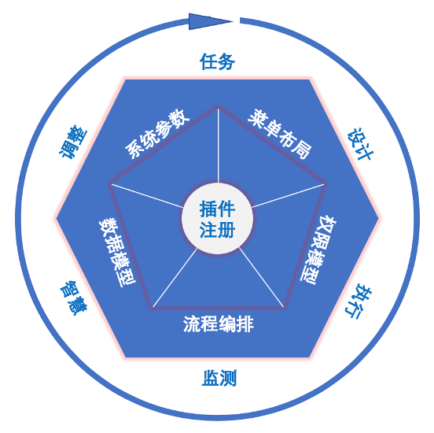
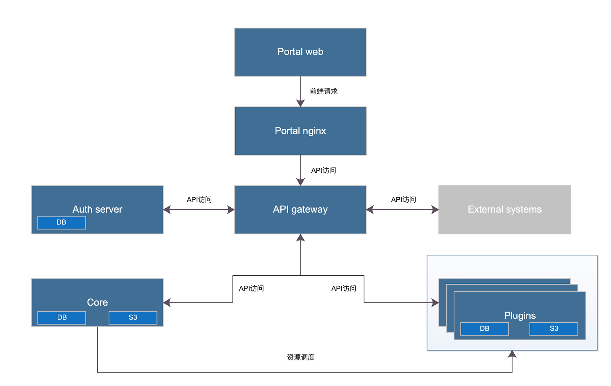
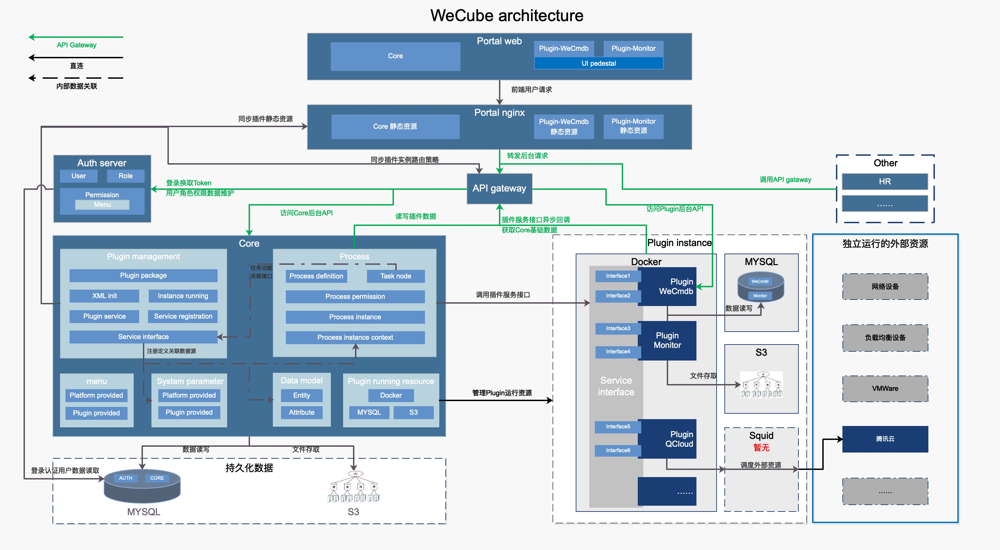
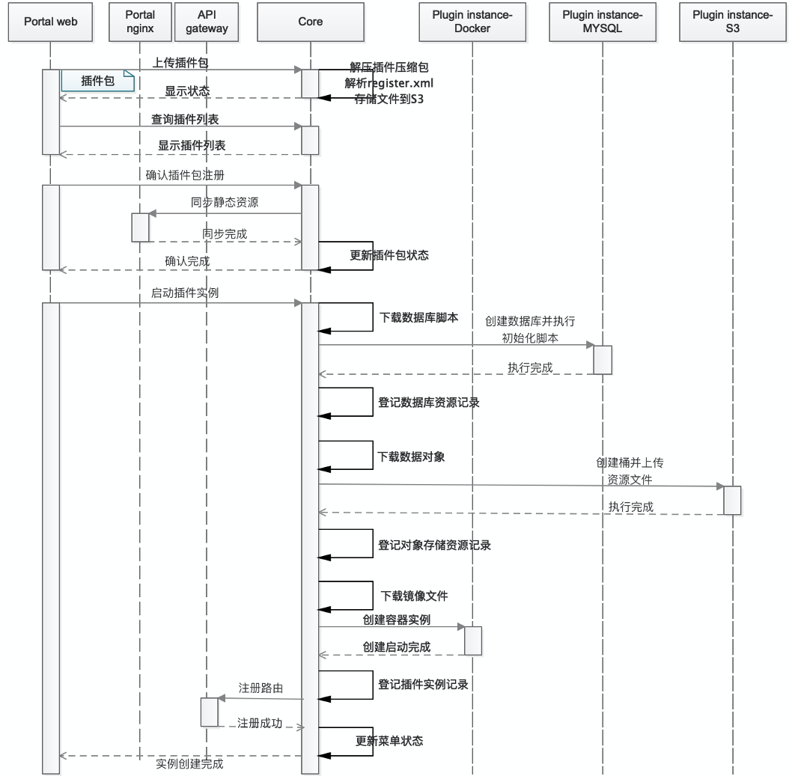
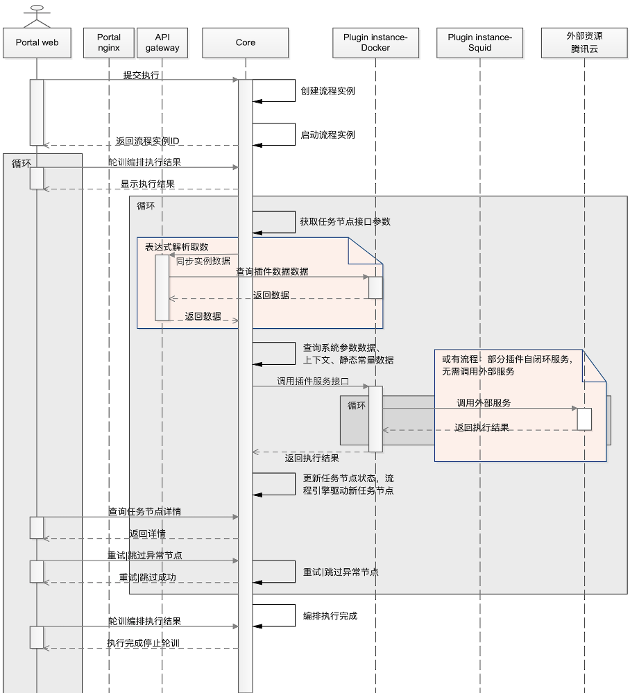

# WeCube

    
    
    
    
    
    
    
    

中文 / [English](README_EN.md)

## 引言
WeCube是一套开源的，一站式IT架构管理和运维管理工具，主要用于简化分布式架构IT管理，并可以通过插件进行功能扩展。

## 起源
微众银行在分布式架构实践的过程中，发现将银行核心系统构建于分布式架构之上，会遇到一些与传统单体应用不同的痛点（例如，服务器增多，部署难度大；调用链长，全链路跟踪困难； 系统复杂，问题定位时间长等），在逐步解决这些痛点的过程中，总结了一套IT管理的方法论和最佳实践，并研发了与之配套的IT管理工具体系。WeCube就是将该套方法论和最佳实践，从微众内部众多IT管理工具体系中提炼出来，整合成一套开箱即用的IT管理解决方案。

## 设计理念

 

WeCube的设计理念与IT系统生命周期管理基本一致。可以通过“六个维度和一个核心”来阐述。  

**一个核心：通过注册新插件持续扩展WeCube的功能，通过如下5个能力实现插件注册及协作。插件注册详见“插件注册”。**

- 菜单布局：WeCube提供前端UI基座和前端开发规范，使各个插件的前端交互能够无缝集成到WeCube，进而形成一个统一平台。
- 权限模型：WeCube的权限模型提供“用户-角色-菜单”三级权限模型，并提供统一认证方案。数据权限及API权限，由插件自身控制。
- 流程编排：WeCube内置一套标准的BPMN流程引擎，可以通过客户自定义编排驱动插件协同工作，减少人工干预。编排设计详见“编排设计”。
- 数据模型：插件需要将自身需要提供给其他插件使用的数据模型注册到WeCube的统一数据模型，然后通过标准的CRUD接口提供数据访问服务。
- 系统参数：WeCube的全局参数、插件需要客户修改、插件需要暴露给其他插件使用的参数，需要注册到WeCube的系统参数内。

**六个维度：通过定义六个维度的菜单，并将插件功能有组织性的插入这六个维度菜单中，形成对IT系统全生命周期的有效管理。**

- 任务：汇聚多种类型任务，形成一体化的工作平台。工作内容清晰可见，轻重缓急一目了然。
- 设计：定义模型和规范，形成标准化设计语言。通过规范化设计及图形化展示，清晰、准确地描绘出对分布式架构的期望。
- 执行：通过各类自动化、标准化任务的执行，将分布式架构的期望设计变成现实存在，消除人员能力参差不齐导致的实现差异。
- 监测：定义全方位的监测项指标，通过持续收集监测数据，精确反映现状，并发现现实与期望的差异项。
- 智慧：应用机器学习等技术，赋予智慧能力。通过数学建模，制定应对监测发现的差异项的处理策略。
- 调整：通过执行处理策略来不断进行动态调整，最终保持现实与期望的对等，进而使系统稳定运行。

## 技术实现
WeCube分为核心功能模块和插件模块。

核心功能模块使用Java/MySQL/VUE开发，主要负责工作流程，可视化和核心数据存储。

插件模块用于功能扩展，分为资源管理、数据整合、功能增强三类插件。对于插件，WeCube定义了一套接口规范，插件开发者可以在遵循规范的前提下，自行选择开发语言。目前已有的插件使用的开发语言包括GO语言和Java。

## 系统架构

### WeCube 2.0版本
 

组件间详细关联图：

 

1, Portal web：浏览器客户，客户与WeCube交互的入口。  
2, Portal nginx：接收客户端访问请求，如果请求静态资源，返回Core或插件的静态资源文件。如请求动态服务，转发到后端API gateway。Portal nginx建议采用负载均衡实现高可用，也可以使用keepalived做主从高可用。  
3, API gateway：负责Portal nginx或其他外部系统的动态服务请求的路由分发。  
 - A）	登录认证请求，转发到Auth server，使用用户名密码换取Token。Token采用非对称加密，包含用户名、角色、菜单权限信息。
 - B）	Core服务请求，转发到Core。比如角色添加、插件注册、编排设计等等。
 - C）	Plugin服务请求，转发到对于的Plugin。比如CMDB配置管理、监控数据查询、任务管理等。

建议负载均衡实现高可用，也可以使用keepalived做主从高可用。  
APIGateway启动时通过Core获取插件实例列表，并建立路由规则。  
同时APIGateway会监测Core、Auth Server、Plugins的状态，实现Core、Auth server、Plugins实例的主从类型的高可用。

4, Auth server：主要负责用户认证服务，并返回含用    
由API gateway实现主从类型的高可用。
5, Core：WeCube的核心模块。提供插件注册、编排设计、权限管理、批量任务、插件运行资源管理、数据模型、系统参数等核心功能。
由API gateway实现主从类型的高可用。  
6, MYSQL：WeCube Core和Auth server的数据库实例。建议MYSQL主从实现高可用。  
7, S3:插件包镜像文件的存储。插件注册是写入镜像文件，插件实例启动时读取镜像文件。  
8, Plugin instance-Docker：插件运行的容器母机，可以配置多台母机，运行多个插件实例，提供高可用。  
9, Plugin instance-MYSQL：插件运行所需要的数据库实例，为每个需要数据库的插件建立独立数据库。建议MYSQL主从实现高可用。  
10, Plugin instance-S3：插件运行所需要的对象存储，为每个需要存储文件的插件分配单独的桶。  
11, Plugin instance- Squid：插件访问外部资源的代理服务器，按域名放通白名单。在安全要求较高的时建议部署。  
以上11个组件组成WeCube Platform。

## 主要功能简介
WeCube的功能菜单设计与设计理念保持一致。分别是任务、设计、执行、监测、智慧、调整、协同、系统。  

- 系统  

	- 系统参数：管理WeCube Platform运行所需的系统参数。   
	- 资源管理：管理WeCube提供的资源如容器母机及资源上运行的实例。   
	- 权限管理：管理WeCube Platform的用户，角色和菜单，可以对权限进行菜单级别的管控。  

- 协同

	- 插件注册：选择插件包上传，插件包需声明本插件的依赖、所需菜单、数据模型、系统参数、权限设定及运行资源，注册后通过容器运行，支持多实例，可以查看插件运行的日志。选择插件服务，通过插件运行的参数关联CMDB数据模型的属性值，形成注册。  

	- 任务编排：比如设计一个VPC创建的编排。包括创建VPC、创建子网、创建VM。流程的每个执行节点需要关联插件。  

- 设计（WeCMDB插件提供）

	- 规划设计：用于设计机房结构。

	- 资源规划：用于实例化一个机房，特别是两地三中心结构。

	- 应用架构设计：用于设计一个应用的逻辑架构。

	- 应用部署设计：用于实际部署一个应用。支持灰度发布。

	- CI数据管理/查询：通过模型图形进入单个数据管理以及查询。

	- CI综合查询管理/数据综合查询：用于配制多CI属性报表。比如一个应用使用到了哪些主机。

	- 枚举数据管理/查询：通过对公共枚举和私有枚举进行管理以及查询。

- 执行

	- 编排任务执行：在选择编排后可对选择目标对象执行编排，支持灰度操作。比如重启某个资源集的5台主机。  
	
	- 物料管理（Artifacts插件提供）：管理应用程序的包。可以定义各种文件，可以配置环境差异导致的变量替换规则，不需要人工处理。

	- 批量执行：通过配置综合查询并选择目标。在通过特定插件来执行任务。比如某个应用的所有主机，执行一个用户权限变更。
	

- 任务（Service-Management插件提供）

	- 模板管理：服务目录管理， 服务请求模板管理；
	
	- 服务管理：服务请求管理，任务管理；

- 监测（Open-Monitor插件提供）

	- Agent管理: 注册、启动、停止；
	
	- 数据管理: 提供数据采集配置， 数据查询等功能；
	
	- 告警管理: 提供阈值配置、日志监控、告警触发等功能；
	
	- 视图管理: 提供图形配置和自定义视图功能；

- 调整（规划中）

- 智慧（规划中）
  
## 核心流程时序说明：

插件注册时序图:  
 

编排任务执行:   
 
## 快速入门
WeCube采用容器化部署。

如何编译WeCube，请查看以下文档
[WeCube编译文档](wecube-wiki/docs/install/wecube_compile_guide.md)

如何安装WeCube， 请查看以下文档
[WeCube部署文档](wecube-wiki/docs/install/wecube_install_guide.md)

## 用户手册
更多关于WeCube的使用和操作说明， 请查看以下文档
[WeCube用户手册](wecube-wiki/docs/manual/wecube_user_guide.md)

## 开发者文档
WeCube使用Java和VUE进行开发，数据存储于MySQL，并依赖Tomcat Web容器运行。

请参考以下文档进行开发环境配置[WeCube开发环境配置](wecube-wiki/docs/developer/wecube_developer_guide.md)

## License
WeCube是基于 Apache License 2.0 协议， 详情请参考 [LICENSE](LICENSE)

## 社区
- 如果您想得到最快的响应，请给我们提[Issue](https://github.com/WeBankPartners/wecube-platform/issues/new/choose)或扫描下面的二维码，我们会第一时间反馈。

	

	
	

- 联系我们：fintech@webank.com
