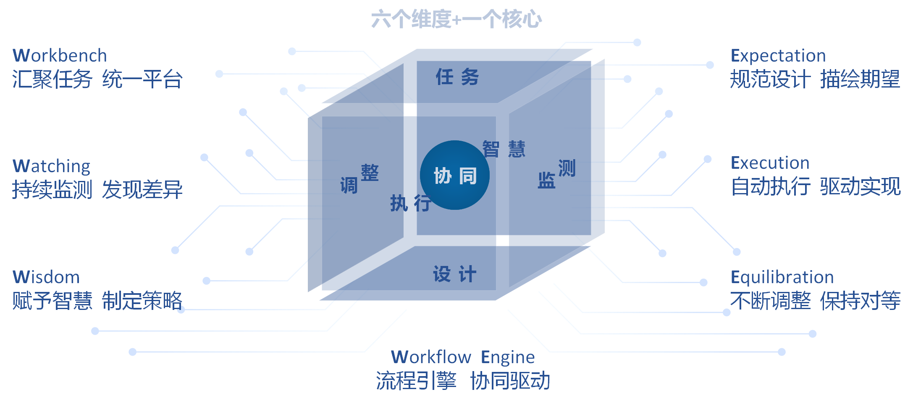

# WeCube

## 引言
WeCube是一套开源的，一站式IT架构管理和运维管理工具，主要用于简化分布式架构IT管理，并可以通过插件进行功能扩展。

## 起源
微众银行在分布式架构实践的过程中，发现将银行核心系统构建于分布式架构之上，会遇到一些与传统单体应用不同的痛点（例如，服务器增多，部署难度大；调用链长，全链路跟踪困难； 系统复杂，问题定位时间长等），在逐步解决这些痛点的过程中，总结了一套IT管理的方法论和最佳实践，并研发了与之配套的IT管理工具体系。WeCube就是将该套方法论和最佳实践，从微众内部众多IT管理工具体系中提炼出来，整合成一套开箱即用的IT管理解决方案。

## 设计理念
 

WeCube的设计理念与IT系统生命周期管理基本一致。可以通过“六个维度和一个核心”来阐述。

- 第一个维度：Workbench，汇聚任务、统一平台。就是将需要人员执行的任务全部汇聚在一个平台上。这样工作内容清晰可见，轻重缓急一目了然。 类似ITSM。
- 第二个维度：Expectation，规划设计、描绘期望。就是定义模型和规范，形成标准化设计语言。通过规范化设计及图形化展示，清晰、准确描绘出对分布式架构的期望。 
- 第三个维度：Execution，自动执行、驱动实现。就是通过各类自动化、标准化任务的执行，将期望设计变成现实存在，消除人员能力参差不齐导致的实现差异。 
- 第四个维度：Watching，继续监测、发现差异。就是定义全方位的监测项指标，通过持续收集监测数据，精确反映现实存在的现状，并发现现实与期望的差异项。 
- 第五个维度：Wisdom，赋予智慧、制定策略。就是应用机器学习等技术，赋予We3智慧的能力。通过数学建模，制定应差异项的处理策略。 比如资源扩容策略、故障处理策略。
- 第六个维度：Equilibration，不断调整、保持对等。就是通过执行处理策略来不断进行动态调整，最终保持现实与设计的对等，进而使系统稳定运行。 
- 一个核心：Workflow Engine，流程引擎、协同驱动。通过工作流引擎赋予We3协同驱动能力，从而高效组织以上六个维度组件的协同运行，减少人工处理环节，提高团队工作效率。 

## 技术实现
WeCube分为核心功能模块和插件模块。核心功能模块使用Java/MySQL/VUE开发，主要负责工作流程，可视化和核心数据存储。插件模块用于功能扩展，分为资源管理、数据整合、功能增强三类插件。对于插件，WeCube定义了一套接口规范，插件开发者可以在遵循规范的前提下，自行选择开发语言。目前已有的插件使用的开发语言包括GO语言和Java。

## 主要功能
WeCube的功能菜单设计与设计理念保持一致。分别是任务、设计、执行、监测、智慧、调整、协同、系统。

- 系统

&ensp;&ensp;&ensp;&ensp;CMDB模型设计, 是系统管理的核心功能，目前WeCube的CMDB模型设计支持完全自定义和图形化展示。

&ensp;&ensp;&ensp;&ensp;权限管理，数据权限控制增删改查执行，并且数据权限控制到行。比如DBA只能有数据库主机的权限，主机只需要一个CI模型就可以了。

&ensp;&ensp;&ensp;&ensp;基础数据,是一些系统参数。

- 协同

&ensp;&ensp;&ensp;&ensp;插件注册，选择插件包上传，并通过容器运行，支持多实例，可以查看插件运行的日志。选择插件，通过插件运行的参数关联CMDB模型的属性值，形成注册。插件包更新历史关联会自动回填。降低升级成本。目前已经有腾讯云资源管理和应用部署服务的插件。

&ensp;&ensp;&ensp;&ensp;任务编排，比如设计一个VPC创建的编排。包括创建VPC、创建子网、创建VM。
流程的每个执行节点需要关联插件。

&ensp;&ensp;&ensp;&ensp;服务通道

- 设计

&ensp;&ensp;&ensp;&ensp;规划设计，用于设计机房结构。

&ensp;&ensp;&ensp;&ensp;资源规划,用于实例化一个机房，特别是两地三中心结构。

&ensp;&ensp;&ensp;&ensp;应用架构设计,用于设计一个应用的逻辑架构。

&ensp;&ensp;&ensp;&ensp;应用部署设计,用于实际部署一个应用。支持灰度发布。

&ensp;&ensp;&ensp;&ensp;CI数据管理/查询，通过模型图形进入单个数据管理以及查询。

&ensp;&ensp;&ensp;&ensp;CI综合查询管理/数据综合查询，用于配制多CI属性报表。比如一个应用使用到了哪些主机。

&ensp;&ensp;&ensp;&ensp;枚举数据管理/查询，通过对公共枚举和私有枚举进行管理以及查询。

- 执行

&ensp;&ensp;&ensp;&ensp;物料管理，管理应用程序的包。可以定义各种文件，可以配置环境差异导致的变量替换规则，不需要人工处理。

&ensp;&ensp;&ensp;&ensp;应用部署，查看部署过程及异常，并作重试处理。

&ensp;&ensp;&ensp;&ensp;批量执行，通过综合查询选择目标。在通过特定插件来执行任务。比如某个应用的所有主机，执行一个用户权限变更。

&ensp;&ensp;&ensp;&ensp;高危命令配置，定义一些高危指令（如rm -rf），阻止执行或触发审批流程。
&ensp;&ensp;&ensp;&ensp;编排任务执行，应该一般任务。比如重启某个资源集的5台主机。

- 任务（2019年下半年）
- 监测（2019年下半年）
- 调整（2019年下半年）
- 智慧（2019年下半年）

## 快速入门
WeCube采用容器化部署。

如何编译WeCube，请查看以下文档
[WeCube编译文档](wecube-wiki/docs/install/wecube_compile_guide.md)

如何安装WeCube， 请查看以下文档
[WeCube部署文档](wecube-wiki/docs/install/wecube_install_guide.md)

## API说明
更多关于WeCube的使用和操作说明， 请查看以下文档
[WeCube API手册](wecube-wiki/docs/api/wecube_api_guide.md)

## 用户手册
更多关于WeCube的使用和操作说明， 请查看以下文档
[WeCube用户手册](wecube-wiki/docs/manual/wecube_user_guide.md)

## License
WeCube是基于 Apache License 2.0 协议， 详情请参考
[LICENSE](LICENSE)

## 社区
- 如果您想得到最快的响应，请给我们提issue，或者关注微信公众号： ，或者您也可以扫码进群：
- 联系我们：fintech@webank.com

