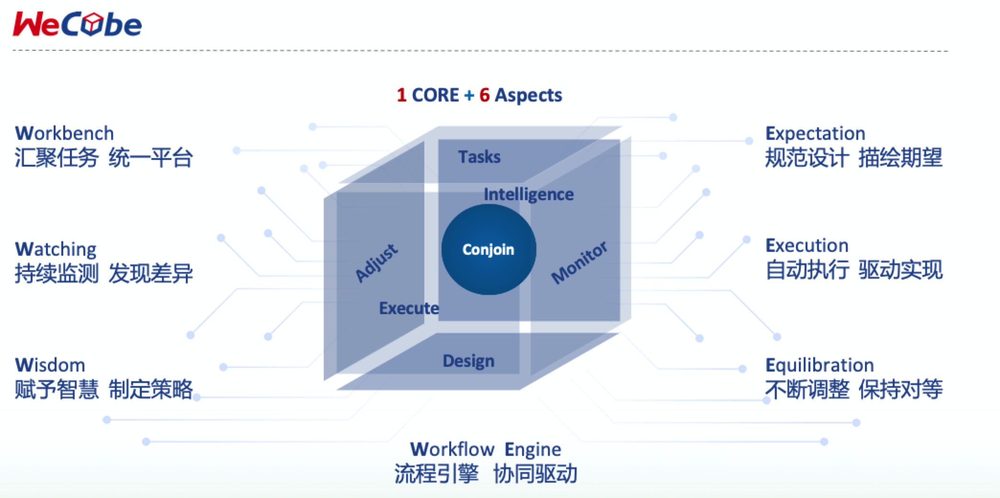
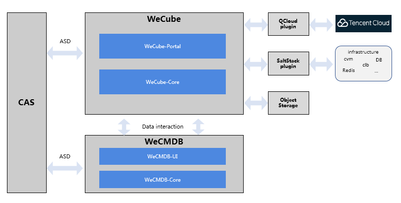
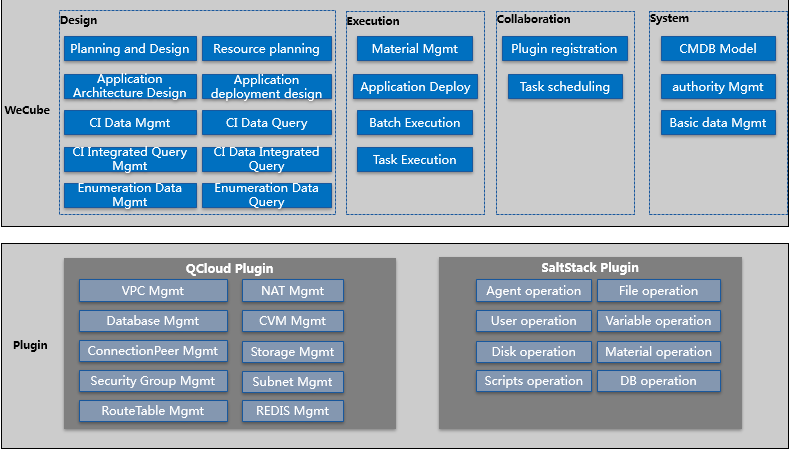

# WeCube

English / [中文](README_CN.md)

## Introduction
WeCube is an open source, one-stop tool for architecture management and IT operation, which aims to simplify the IT management of distributed architecture. Its features can be easily extended by plugins.

## Origin
During the implementation of distributed architecture, core banking systems are built in WeBank. Comparing this to traditional monolithic architecture, there are quite a few different pain points, e.g. increasing number of servers, complicated deployment process, difficulties in service tracing and problem diagnosis due to complex systems and long invocation chains. 

In the process of finding the solutions for these pain points, we have come up with a set of methodology and best practices for IT management in such scenarios and also developed necessary supporting tools. WeCube is the result of extracting the methodology and best practices form WeBank's internal tools, which is then packaged into an integrated out-of-box solution for IT management. 

## Design Concept

WeCube's design concept basically matches the lifecycle of IT system management and can be elaborated as "6 aspects with 1 core".
 
- 1st aspect: "Workbench", it is an ITSM-like workbench that can aggregates all manual tasks so that their contents, importance and priorities are all clear at first glance.

- 2nd aspect: "Expectation", it is to plan, to design, to describe the expectations with models and specifications. By using standard and formal design language together with graphic visualizations, we try to make expectations on distributed architecture accurately and clearly.

- 3rd aspect: "Execution", it is to execute tasks in automated and standardized way so that expectations become realities without introducing errors or deviations caused by people in this process.

- 4th aspect: "Watching", it is to uncover differences between realities and expectations by defining all-round metrics which can reflect the varying runtime situation, then consistently collecting and keeping track of the information.

- 5th aspect: "Wisdom", it is to add intelligence into WeCube by means of data modeling and machine learning, so that policies can be developed to deal with errors and deviations, such as policies for trouble shooting, cause analysis, resource scaling.

- 6th aspect: "Equilibration", it is to ensure that realities are conforming to design expectations by applying policies and making consistent adjustments, so that running systems are stable in a dynamic way. 

- the core: "Workflow Engine", it is to coordinate tasks and improve collaborations in those 6 aspects, so that manual intervention is reduced and team efficency is increased.

## Implementations
WeCube is composed of the core framework and plugins for feature exetnsions.

The core framework is developed with Java/MySQL/Vue.js and reponsible for workflow management, data visualization and core data persistence.

Plugins are introduced for feature extensions, they can be grouped into 3 categories: resource management, data integration and practice enhancement. By conforming to the interface specification defined by WeCube, plugin developers can choose their preferred programing languages. Existing plugins commonly use Go and Java.

## System Architecture

### WeCube Version 1.x
WeCube version 1.0 is released, its architecture is elaborated as follows: 

 

- WeCube version 1.0 uses WeCMDB for data persistence, configuration data are all managed by WeCMDB.
- WeCube version 1.0 requires a CAS server for authentication, in order to keep data permissions consistent, we suggest to share the same CAS server used by WeCMDB. In WeCube version 1.1, a local user based authentication mode is supported.
- WeCube version 1.0 requires a S3-compatible object storge service for artifacts and scripts. 
- WeCube version 1.0 includes 2 plugins: Tencent Cloud plugin for resource mangement and SaltStack plugin for automated deployment. 

Implemented features in WeCube Version 1.0:

 

### WeCube Version 2.0
WeCube Version 2.0 is under active development and will come soon.

## Main Features
The main menu of WeCube matches its design concept, including Workbench, Expectation, Execution, Watching, Wisdom, Equilibration, Workflow and System.

- System
  - CMDB model design: support customization and graphic visualization.
  - authorization: row-based data permission control for CRUD operations. For example, DBA can only operate on DB hosts instead of application hosts in case that all hosts share one single CI type.  
  - system parameters

- Workflow
  - plugin registration: to upload plugin packages and create their runtime environments in containers. 
  - task orchestration: to design workflows to finish automated or semi-automated tasks, such as task orchestration to create VPC, subnet and virtual machines on public cloud. Each node in the workflow is associated with a plugin for execution.
  - service channel

- Expectation
  - data center design: to create a plan and to design the sturcture of data centers
  - data center resource plan: to instanciate a data center design and plan actual resources for a specific data center
  - application architecture design: to design logical architecture of applications
  - application deployment design: to design the deployment architectural view and trigger deployment for applications
  - CI data query and management: to query and manage data for a single CI type through the graph of CI model
  - CI integrated query: to configure queries involving multiple CI types, for example to find out all hosts used by a specific application
  - enumeration query and danagement

- Execution
  - artifact management: to manage deployment packages for applications. Customization of configuration file and value substitution rules is supported to eliminate manual intervention.
  - application deployment: to view deployment history, to skip or retry deployment tasks.
  - batch execution: to execute simple operation tasks in a selected scope of targets. 
  - high risk commands: to define high risk commands, so they will be blocked or extra approval process will be raised.
  - task orchestration execution: to execute complicated operations with predefined workflow and plugins.

- Tasks (2nd half of 2019)

- Watching (2nd half of 2019)

- Equilibration (2nd half of 2019)

- Wisdom (2nd half of 2019)

## Quick Start
WeCube is using containerized deployment.

PLease refer to [WeCube Compilation Guide](wecube-wiki/docs/install/wecube_compile_guide_en.md) on how to compile WeCube.

PLease refer to [WeCube Installation Guide](wecube-wiki/docs/install/wecube_install_guide_en.md) on how to install WeCube.

## User Manual
Please refer to the [WeCube User Guide](wecube-wiki/docs/manual/wecube_user_guide.md) for guides on WeCube usage and operation.

## Developer Documentation
WeCube is developed with Java and Vue.js, it uses MySQL for data persistence and relies on Tomcat as the web application container.

Please refer to the [WeCube Developer Guide](wecube-wiki/docs/developer/wecube_developer_guide_en.md) on how to set up the development environment.

## License
WeCube is licensed uner the Apache License Version 2.0, please refer to [LICENSE](LICENSE) for details.

## Community
- For quick response, please [raise an issue](https://github.com/WeBankPartners/wecube-platform/issues/new/choose) to us, or you can also scan the following QR code to join our community, we will provide feedback as quickly as we can.

  

  
  

- Contact us: fintech@webank.com

