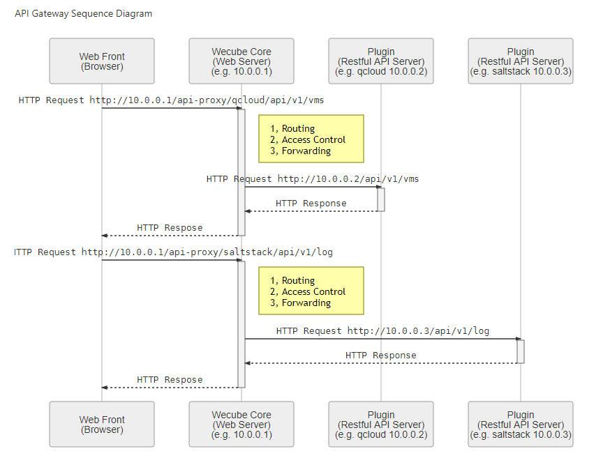

# WeCube API代理与路由

## 背景
Wecube插件是独立于Wecube服务器运行的，对于前端不可达，前端页面访问插件api的http请求需要通过一个gateway代理转发。

## 分析
搭建API Gateway有多种可选的方案：

A - 使用Spring Cloud Gateway搭建一个WebFlux服务器

B - 使用Zuul 搭建一个API Gateway

C - 在现有的wecube-core中使用SpringMVC Controller的功能实现一个简单的api代理网关功能

方案A使用了Spring WebFlux框架，不方便与现有wecube-core集成，需要单独部署一个进程，是一个比较重的实现方案。由于需求只是一个简单的http请求转发功能以及依据url path选择插件服务器进行路由的功能，选择方案C实现一个最轻的API代理网关更符合项目组对于保持代码简单降低开发员上手难度的精神。

## 设计

API代理网关工作原理时序图

工作原理说明（如上图）：

步骤1， 前端页面通过wecube-core服务器（10.0.0.1）访问插件(运行时实例为10.0.0.2)的api (例如 http://10.0.0.1/api-proxy/qcloud/api/v1/vms)

步骤2，wecube-core服务器识别url以/api-proxy开头，判断该http请求需要使用api代理网关进行处理(由spring mvc框架实现)

步骤3， 路由(Routing) - api代理网关根据/qcloud判断该http请求需要转发给QCloud插件，从而在数据库查找QCloud插件的运行实例的ip地址，从而实现路由功能

步骤4， 鉴权（Access Control) - api代理网关根据当前登录人的角色信息判断是否具备目标插件的访问权限

步骤5， 转发(Forwarding) - api代理网关根据配置将http请求转发给目标插件，(例如 http://10.0.0.2/api/v1/vms)

