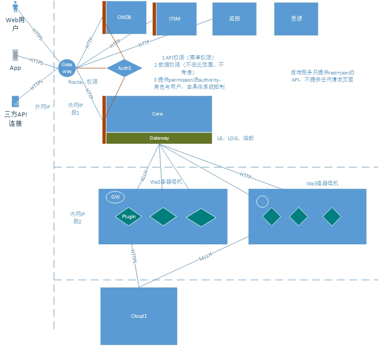
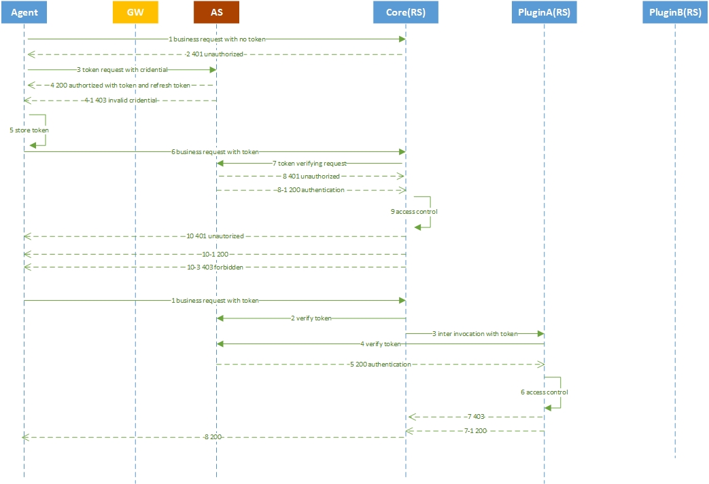

# Platform用户认证模式

## 背景   

统一和系统的考虑和实现platform的用户认证模式。

## 用户认证模块在系统上下文的位置

wecube和platform权限认证主要诉求为统一的登录和认证模式。如下图所示，platform的权限认证主要通过集中的认证服务和网关服务来实现。

用户认证模块上下文示意图
    

## 实现方案描述

1 token采用JWT
2 支持前后端分离
3 支持无状态服务

主要交互流程如下图所示：

