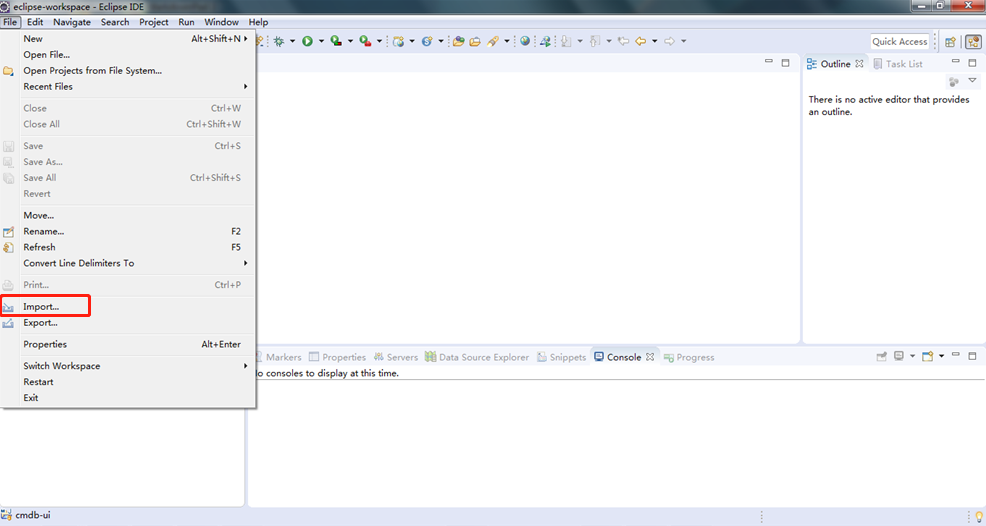
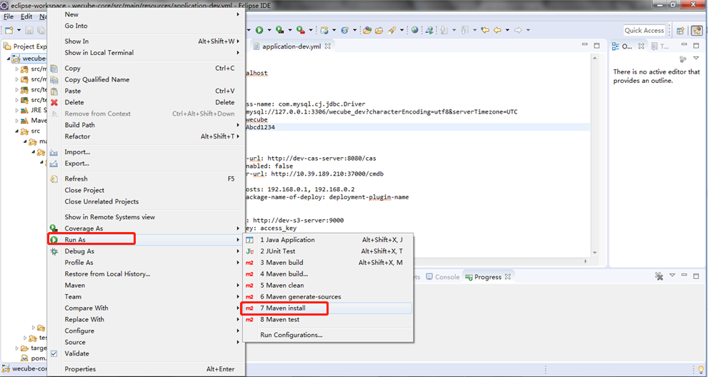
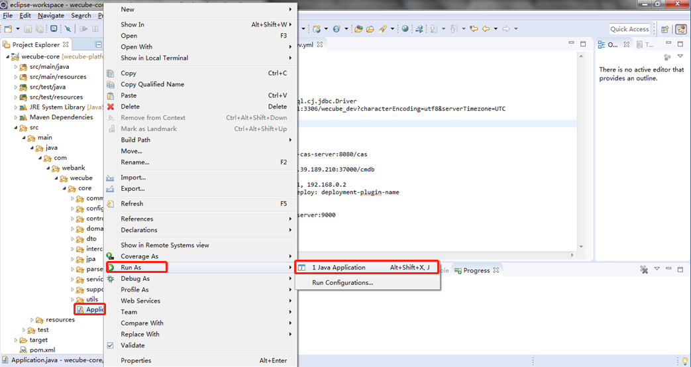
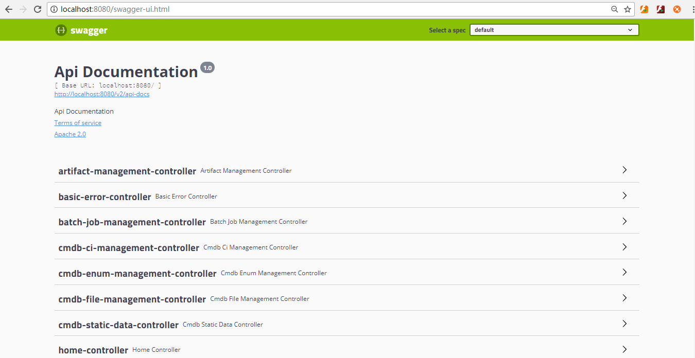
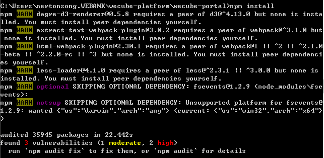
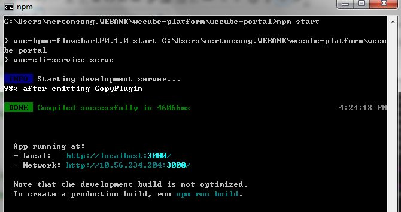

# WeCube Developer Guide

## 准备工作
1. 安装JDK
	
	需要在开发电脑上先安装JDK，请参考[JDK安装文档](https://github.com/WeBankPartners/we-cmdb/blob/master/cmdb-wiki/docs/developer/jdk_install_guide.md)

2. 安装Eclipse
	
	需要在开发电脑上先安装Eclipse，请参考[Eclipse安装文档](https://github.com/WeBankPartners/we-cmdb/blob/master/cmdb-wiki/docs/developer/eclipse_install_guide.md)

3. 安装Mysql
	
	需要在开发电脑上先安装Mysql，请参考[Mysql安装文档](https://github.com/WeBankPartners/we-cmdb/blob/master/cmdb-wiki/docs/developer/mysql_install_guide.md)

4. 安装CAS
	
	需要有一个CAS服务， 也可以在开发电脑上安装CAS。dockerhub上有容器镜像，可以直接下载安装。
	
	命令如下：
	
	```
	docker pull kawhii/sso
	docker run -d --name cas -p 8443:8443 -p 8878:8080 kawhii/sso
	```
	
	CAS默认用户密码：admin/123

5. 安装node.js
	
	访问node.js官方网站：http://nodejs.cn/download， 下载v10.16.3版本。双击下载后的安装文件， 按默认配置进行安装。

6. 安装对象存储
	
	在本地开发电脑上运行WeCube，如果需要使用物料管理、插件功能，则需要一个支持S3协议的对象存储，可以使用远程服务， 也可以在本地开发电脑部署。本指引以Minio为例。

7. 需要预先部署WeCMDB
	
	在本地开发电脑上运行WeCube，需要WeCMDB支持。
	
	可以使用远程服务器上部署的WeCMDB，也可以在本地开发电脑上运行WeCMDB，详情请查看[WeCMDB介绍](https://github.com/WeBankPartners/we-cmdb/blob/master/README.md)中的“快速入门”和“开发者文档”。
	
	注：需要在WeCMDB的白名单中增加本地IP地址， WeCube才能调用WeCMDB的接口。


## 导入工程
   可以直接从git上拉取代码， 也可以先将代码工程拉取到本地后， 再导入到Eclipse中， 本文以从本地导入为例。

1. 导入工程
	
	选择导入已有项目
	
	
	选择已有maven工程
	
	
	选择wecube的代码目录作为根目录，确认后完成导入。
	
		
	工程导入后， 会自动下载依赖包及编译， 请确保网络连接正常。

2. 切换视图
	
	导入项目后，需要在 *Window > Show View* 中选择 *Project Explorer*
	


3. 初始化数据库

	需要在本地或者远程的数据库上建立用户和database。
	
	参考语句：
	
	```
	create database wecube_dev DEFAULT CHARSET utf8 COLLATE utf8_general_ci; 

	create USER 'wecube'@'localhost' IDENTIFIED WITH mysql_native_password BY 'Abcd1234';

	grant all privileges on `wecube_dev`.* to 'wecube'@'%' identified by 'Abcd1234';
	```
	
	在database上执行以下数据初始化脚本：
	[01.wecube.schema.sql](../../../wecube-core/src/main/database/01.wecube.schema.sql), 
	[02.wecube.system.data.sql](../../../wecube-core/src/main/database/02.wecube.system.data.sql)

4. 配置文件

	在 *Project Explorer* 视图中，将 *application-uat.yml* 复制一份，更名为 *application-dev.yml*
	
	
	打开 *application-dev.yml* ，修改相关配置。

	application-dev.yml配置示例：

	```
	server:
	  port: 8080
	  address: localhost
	
	spring:
	  datasource:
	    driver-class-name: com.mysql.cj.jdbc.Driver
	    url: jdbc:mysql://127.0.0.1:3306/wecube_dev?characterEncoding=utf8&serverTimezone=UTC
	    username: wecube
	    password: password
	
	wecube:
	  core:
	    cas-server-url: http://192.168.10.3:8080/cas
	    cmdb-server-url: http://192.168.20.5:37000/cmdb
	    plugin:
	      plugin-hosts: 192.168.0.1, 192.168.0.2
	      plugin-package-name-of-deploy: deployment-plugin-name
	
	    s3:
	      endpoint: http://dev-s3-server:9000
	      access-key: access_key
	      secret-key: secret_key

	```

	在本地开发模式下可以不启用S3服务，endpoint可以不需要填。

	cmdb-server-url必填， 并需要在WeCMDB中将本地IP添加到白名单中。

	因为WeCube需要调用WeCMDB的接口， WeCMDB需要进行用户鉴权， 所以wecube使用的cas-server-url最好跟WeCMDB使用的是同一个CAS服务。

5. 启动WeCube后端

	打开Window->Preferences窗口， 选择Java->Installed JREs，新增jdk配置，如下图
	

	下载依赖，编译， 如下图：
	
	
	启动
	

	打开 *http://localhost:8080/swagger-ui.html* 打开 *swagger* 页面，， 输入cas登录用户及密码，即可查看并测试API
	


6. 启动WeCube前端
	
	运行CMD（Win+R或右下角点开始菜单的输入处），在展开的命令行窗口中,进入wecube-platform的代码子目录wecube-portal目录

	
	
	执行npm安装命令
	
	```
	npm i
	```

	
	
	安装完成后， 执行命令
	
	```
	npm start
	```

	如下图：

	

	服务已启动， 打开 *http://localhost:3000*, 可看到WeCube的页面

	