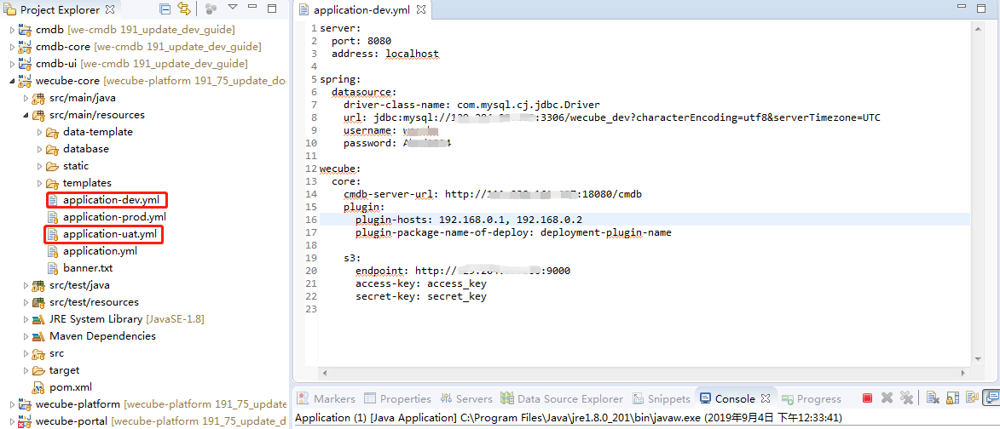
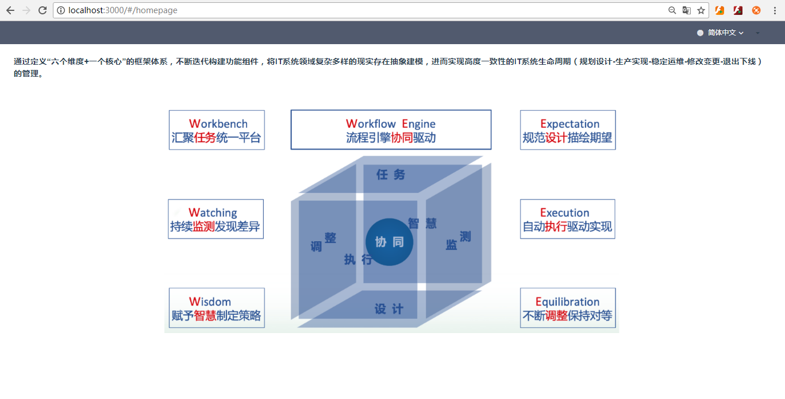

# WeCube Developer Guide

## Preparation

1. Install Java SE Development Kit (JDK)
	
    Please refer to [JDK install guide](https://github.com/WeBankPartners/we-cmdb/blob/master/cmdb-wiki/docs/developer/jdk_install_guide_en.md) on how to install JDK.

2. Install Eclipse
	
    PLease refer to [Eclipse install guide](https://github.com/WeBankPartners/we-cmdb/blob/master/cmdb-wiki/docs/developer/eclipse_install_guide_en.md) on how to install Eclipse.

3. Install Mysql
	
    Please refer to [Mysql install guide](https://github.com/WeBankPartners/we-cmdb/blob/master/cmdb-wiki/docs/developer/mysql_install_guide_en.md) on how to install Mysql.

4. Install node.js
	
    Download node.js v10.16.3 from `http://nodejs.cn/download`. Double-click the downloaded installation file to install it by default configuration.

5. Install object storage (optional)
	
    To run WeCube on a local development computer, if you want to use material management and plugin functions, you need an object storage that supports S3 protocol, you can use remote services, or develop it locally.
    
    Download docker image from dockerhub：https://hub.docker.com/r/minio/minio/
    
    Install command as follows：
    
    ```shell script
    docker pull minio/minio
    docker run -p 9000:9000 -e MINIO_ACCESS_KEY=access_key -e MINIO_SECRET_KEY=secret_key minio/minio server /data
    ```
	
6. Install We-CMDB
	
    Running WeCube on a local development computer requires We-CMDB support.
    
    You can use WeCMDB deployed on a remote server or run WeCMDB on a local development computer. PLease refer to [We-CMDB guide](https://github.com/WeBankPartners/we-cmdb/blob/master/README_EN.md), chapter “Quick Start” and “Developer Guide”. 
    
    Note: The local IP address needs to be added to the WeCMDB whitelist, WeCube can call the WeCMDB API interface.. 


## Import project

You can download the code directly from git, or you can clone the code project to the local and then import it into Eclipse. This article takes local import as an example.

1. Import project
	
    Choose to import an existing project
    
    
    Choose an existing maven project
    
    
    Select the code directory of wecube as the root directory, confirm and complete the import.
    
        
    After the project is imported, the dependencies and compilations are automatically downloaded. Make sure the network connection is normal.

2. Switch view
	
    After the project is imported, open the menu *Window > Show View*, choose *Project Explorer*
    
    

3. Initialize the database

    Users and databases need to be built on a local or remote database.

    Sample sql as follows：

    ```sql
    create database wecube_dev DEFAULT CHARSET utf8 COLLATE utf8_general_ci; 
    
    create USER 'wecube'@'localhost' IDENTIFIED WITH mysql_native_password BY '***REMOVED***';
    
    grant all privileges on `wecube_dev`.* to 'wecube'@'%' identified by '***REMOVED***';
    ```

    Execute the following data initialization script on the database：

    [01.wecube.schema.sql](../../../wecube-core/src/main/database/01.wecube.schema.sql)
     
    [02.wecube.system.data.sql](../../../wecube-core/src/main/database/02.wecube.system.data.sql)

4. Configuration customization

    In *Project Explorer* view, copy `application-uat.yml` and rename as `application-dev.yml`
    
    
    Edit `application-dev.yml` , Modify the relevant configuration, without CAS in development mode, you can remove the CAS related configuration.
    
    `application-dev.yml` sample as follows：
    
    ```yaml
    server:
      port: 8080
      address: localhost
    
    spring:
      datasource:
        driver-class-name: com.mysql.cj.jdbc.Driver
        url: jdbc:mysql://127.0.0.1:3306/wecube_dev?characterEncoding=utf8&serverTimezone=UTC
        username: wecube
        password: password
    
    wecube:
      core:
        cmdb-server-url: http://192.168.20.5:37000/cmdb
        plugin:
          plugin-hosts: 192.168.0.1, 192.168.0.2
          plugin-package-name-of-deploy: deployment-plugin-name
    
        s3:
          endpoint: http://dev-s3-server:9000
          access-key: access_key
          secret-key: secret_key
    
    ```
    
    In the local development mode, you can not enable the S3 service, and the endpoint does not need to be filled.
    
    `cmdb-server-url` is required, and the local IP needs to be added to the We-CMDB whitelist.

5. Start WeCube backend server

    Open `Window -> Preferences`,  choose `Java -> Installed JREs`, add new jdk config as follows:
    
    
    
    Download dependencies, compile, as follows：
    
    
    
    Start service:
    
    
    
    Enter the following url in the browser *http://localhost:8080/swagger-ui.html*, it will redirect to the login page
    
    
    
    Confirm after entering the user, will be redirected to the home page
    
    
    
    Enter the following url again in the browser *http://localhost:8080/swagger-ui.html* , Go to the swagger page
    
    
    
6. Start WeCube frontend client
	
    Run CMD (Win+R or the bottom right corner of the start menu entry), in the expanded command line window, enter the wecube-platform code subdirectory wecube-portal.
    
    
    
    Install npm
    
    ```shell script
    npm install
    ```
    
    
    
    After the installation is complete, execute the command
    
    ```shell script
    npm start
    ```
    
    as follows：
    
    
    
    Service started, open *http://localhost:3000*, go to the WeCube home page
    
    