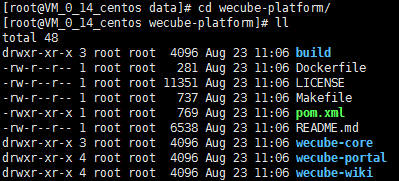
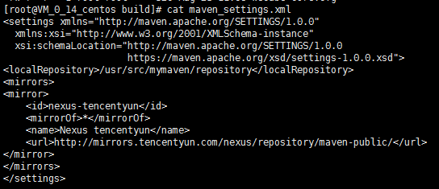
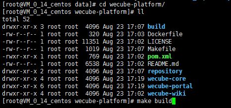
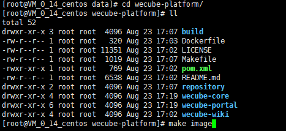
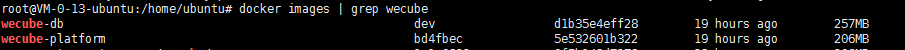

# WeCube Compile Guide

## Before compilation
1. one Linux host, resource configuration is recommended 4 cores 8GB or more for speed up the compilation.
2. The operating system version is recommended to be ubuntu16.04 or higher or centos7.3 or higher.
3. The network needs to be able to access internet (need to download and install the software from internet).
4. install Git
	- yum install
	```
 	yum install -y git
 	```
	- PLease refer to [git install guide](https://github.com/WeBankPartners/we-cmdb/blob/master/cmdb-wiki/docs/install/git_install_guide_en.md) on how to install manually.

5. install docker1.17.03.x or higher
	- PLease refer to [docker install guide](https://github.com/WeBankPartners/we-cmdb/blob/master/cmdb-wiki/docs/install/docker_install_guide_en.md) on how to install docker.

## Compiling and Packaging
1. pull source code from github

	Switch to the local repository directory and execute the command as following
	
	```
	cd /data	
	git clone https://github.com/WeBankPartners/wecube-platform.git
	```

	Enter the github account username and password as prompted, and you can pull the source code to the local.

    After that, enter the wecube-platform directory and the structure is as follows:
	
	

2. compile

	The maven configuration file is in the maven_setting.xml file in the build directory. The default configuration is as follows:

	

	During the compilation process, the maven package and the npm package will be pulled from the external network. If there is a faster maven source, the configuration in the file can be modified.

	Execute the following command in the root of the code:

    ```
	make build
	```
	
	Waiting for compilation to complete，as follows：

	

3. build image
	
	After compilation is complete，Execute the following command in the root of the code:

    ```
	make image
	```
	
	as follows：

	

	start to make WeCube's runtime image.
	
	if you still need WeCube's database image，execute the command as following：

	```
	cd build/db
	chmod +x build-image.sh
	./build-image.sh
	```

	After all images is made， execute the command as following：

	```
	docker images
	```
	
	Will show you the image list as follows:
	
	
	
4. save the image
	
	Want to save the image to linux local directory, execute the command as following：
	
	```
	docker save -o wecube-platform.tar wecube-platform
	docker save -o wecube-db.tar wecube-db
	```

	In the current local directory, you can see the saved files, send the image file to the deployment machine, and start deploying.

	The image can also be uploaded to the remote mirror repository and pulled from the remote mirror repository during deployment.
