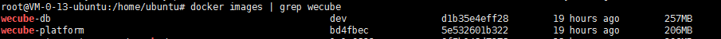

# WeCube Install Guide

The WeCube runtime environment consists of three components: wecube-app, wecube-db (mysql), minio (object storage). The installation packages for these three components are provided as docker images.

This installation guide starts the WeCube service by means of docker-compose. You do not need to install the mysql and minio object storage separately. You can modify some configuration files to use the existing mysql and minio object storage.


## Before installation
1. one Linux host, resource configuration is recommended 4 cores 8GB or more for speed up the compilation；
2. The operating system version is recommended to be ubuntu16.04 or higher or centos7.3 or higher。
3. The network needs to be able to access internet (need to download and install the software from internet。
4. install docker and docker-compose。
     - PLease refer to [docker install guide](https://github.com/WeBankPartners/we-cmdb/blob/master/cmdb-wiki/docs/install/docker_install_guide_en.md) on how to install docker.
     - PLease refer to [docker-compose install guide](https://github.com/WeBankPartners/we-cmdb/blob/master/cmdb-wiki/docs/install/docker-compose_install_guide_en.md) on how to install docker-compose.
5. Make sure we-cmdb has been deployed and can access normally
	
	Need to know the access ip and port of we-cmdb.

	Confirm that the we-cmdb ip whitelist already contains the ip of the wecube deployment host.
	
	You can check the configuration items in the configuration file cmdb.cfg in the installation documentation of we-cmdb：

	```
	cmdb_ip_whitelists={$cmdb_ip_whitelists}
	```

	If we-cmdb is already running, need to modify this configuration, you need to enter the application container of we-cmdb, modify the configuration parameters in the script file start.sh
	
	```
	--cas-server.whitelist-ipaddress=127.0.0.1
	```

	Replace 127.0.0.1 to wecube's host ip，restart we-cmdb service.


## Load images
    
   Load docker image from files , execute the command as following：

   ```
   docker load --input wecube-platform.tar
   docker load --input wecube-db.tar 
   ```

   Execute command'docker images' ，Can see that the image has been imported：

   

	Make a note of the image name and TAG in the mirror list, which is needed in the following configuration.

## Configuration
1. create installation directory and files
   
	Create an installation directory on the deployment machine and create the following three files.:

	[wecube.cfg](../../../build/wecube.cfg)

	[install.sh](../../../build/install.sh)

	[uninstall.sh](../../../build/uninstall.sh)

	[docker-compose.tpl](../../../build/docker-compose.tpl)


2. config wecube.cfg as follows

	```
	#wecube-core
	wecube_server_port=9090
	wecube_image_name={$wecube_image_name}
	wecube_plugin_hosts=100.107.119.14,100.107.119.79
	wecube_plugin_host_port=22
	wecube_plugin_host_user={$plugin_host_user_name}
	wecube_plugin_host_pwd={$plugin_host_password}
	
	#cmdb
	cmdb_url=http://{$cmdb_server_ip}:{$cmdb_server_port}/cmdb
	
	#database
	database_image_name={$wecube_database_image_name}
	database_init_password={$wecube_database_init_password}
	
	#s3
	s3_url=http://{$minio_server_ip}:9000
	s3_access_key=access_key
	s3_secret_key=secret_key
	```

	config items               |desc
	---------------------------|--------------------
	wecube_server_port         |port of wecube's service
	wecube_image_name          |wecube's docker image name and TAG， such as：wecube-platform:bd4fbec
	wecube_plugin_hosts        |plugin host's ip， make sure docker has been installedon every host
	wecube_plugin_host_port    |plugin host's ssh port
	wecube_plugin_host_user    |plugin host's ssh user，it is best to be the root user. If it is another user, please ensure that the user has the right to execute the docker command and the read/write permission of the /opt directory.
	wecube_plugin_host_pwd     |plugin host's ssh password
	cmdb_url                   |we-cmdb's url
	database_image_name        |wecube's database docker image name and TAG，such as：wecube-db:dev
	database_init_password     |wecube database password
	s3_url                     |object storage server's ip address, docker-compose.tpl already contains minio S3 service configuration
	s3_access_key              |minio's access_key
	s3_secret_key              |minio's secret_key

3. config install.sh as follows：

	```
	#!/bin/bash
	set -ex
	if ! docker --version &> /dev/null
	then
	    echo "must have docker installed"
	    exit 1
	fi
	
	if ! docker-compose --version &> /dev/null
	then
	    echo  "must have docker-compose installed"
	    exit 1
	fi
	
	source wecube.cfg
	
	sed  "s~{{WECUBE_DATABASE_IMAGE_NAME}}~$database_image_name~" docker-compose.tpl >  docker-compose.yml  
	sed -i "s~{{WECUBE_IMAGE_NAME}}~$wecube_image_name~" docker-compose.yml  
	sed -i "s~{{WECUBE_SERVER_PORT}}~$wecube_server_port~" docker-compose.yml 
	sed -i "s~{{MYSQL_ROOT_PASSWORD}}~$database_user_password~" docker-compose.yml 
	sed -i "s~{{CMDB_SERVER_URL}}~$cmdb_url~" docker-compose.yml 
	sed -i "s~{{WECUBE_PLUGIN_HOSTS}}~$wecube_plugin_hosts~" docker-compose.yml
	sed -i "s~{{WECUBE_PLUGIN_HOST_PORT}}~$wecube_plugin_host_port~" docker-compose.yml
	sed -i "s~{{WECUBE_PLUGIN_HOST_USER}}~$wecube_plugin_host_user~" docker-compose.yml
	sed -i "s~{{WECUBE_PLUGIN_HOST_PWD}}~$wecube_plugin_host_pwd~" docker-compose.yml
	sed -i "s~{{S3_URL}}~$s3_url~" docker-compose.yml
	sed -i "s~{{S3_ACCESS_KEY}}~$s3_access_key~" docker-compose.yml
	sed -i "s~{{S3_SECRET_KEY}}~$s3_secret_key~" docker-compose.yml
	
	docker-compose  -f docker-compose.yml  up -d
	
	```

4. config uninstall.sh as follows
	
	```
	#!/bin/bash
	docker-compose -f docker-compose.yml down -v
	```

5. config docker-compose.tpl as follows
	
	The service to be installed is configured in this file: wecube, mysql, minio。

	If you already have minio and mysql, comment out the two paragraphs in the file. In the environment configuration of the wecube, manually modify the s3 and database configuration.
	
	Detailed code is as follows:

	```
	version: '2'
	services:
	  minio:
	    image: minio/minio
	    restart: always
	    command: [
	        'server',
	        'data'
	    ]
	    ports:
	      - 9000:9000
	    volumes:
	      - /data/minio-storage/data:/data    
	      - /data/minio-storage/config:/root
	      - /etc/localtime:/etc/localtime
	    environment:
	      - MINIO_ACCESS_KEY={{S3_ACCESS_KEY}}
	      - MINIO_SECRET_KEY={{S3_SECRET_KEY}}
	  mysql:
	    image: {{WECUBE_DATABASE_IMAGE_NAME}}
	    restart: always
	    command: [
	            '--character-set-server=utf8mb4',
	            '--collation-server=utf8mb4_unicode_ci',
	            '--default-time-zone=+8:00'
	    ]
	    environment:
	      - MYSQL_ROOT_PASSWORD={{MYSQL_ROOT_PASSWORD}}
	    volumes:
	      - /data/wecube/db:/var/lib/mysql
	      - /etc/localtime:/etc/localtime
	  wecube:
	    image: {{WECUBE_IMAGE_NAME}}
	    restart: always
	    depends_on:
	      - mysql
	    volumes:
	      - /data/wecube/log:/log/ 
	      - /etc/localtime:/etc/localtime
	    networks:
	      - wecube-core
	    ports:
	      - {{WECUBE_SERVER_PORT}}:8080
	    environment:
	      - TZ=Asia/Shanghai
	      - MYSQL_SERVER_ADDR=wecube-mysql
	      - MYSQL_SERVER_PORT=3306
	      - MYSQL_SERVER_DATABASE_NAME=wecube
	      - MYSQL_USER_NAME=root
	      - MYSQL_USER_PASSWORD={{MYSQL_ROOT_PASSWORD}}
	      - CMDB_SERVER_URL={{CMDB_SERVER_URL}}
	      - WECUBE_PLUGIN_HOSTS={{WECUBE_PLUGIN_HOSTS}}
	      - WECUBE_PLUGIN_HOST_PORT={{WECUBE_PLUGIN_HOST_PORT}}
	      - WECUBE_PLUGIN_HOST_USER={{WECUBE_PLUGIN_HOST_USER}}
	      - WECUBE_PLUGIN_HOST_PWD={{WECUBE_PLUGIN_HOST_PWD}}
	      - S3_ENDPOINT={{S3_URL}}
	      - S3_ACCESS_KEY={{S3_ACCESS_KEY}}
	      - S3_SECRET_KEY={{S3_SECRET_KEY}}
	```

## installation
1. Execute the following command to start the WeCube service through docker-compose

	```
	/bin/bash ./install.sh
	```

2. check
	
	Visit WeCube's url http://wecube_server_ip:wecube_server_port to confirm that the page is accessed normally.


## uninstall
Execute the following command to stop the WeCube service through docker-compose.

```
/bin/bash ./uninstall.sh
```

## restart
Execute the following command to stop the WeCube service through docker-compose.

```
/bin/bash ./uninstall.sh
```

Modify the wecube.cfg configuration file as needed to restart the service

```
/bin/bash ./install.sh
```
