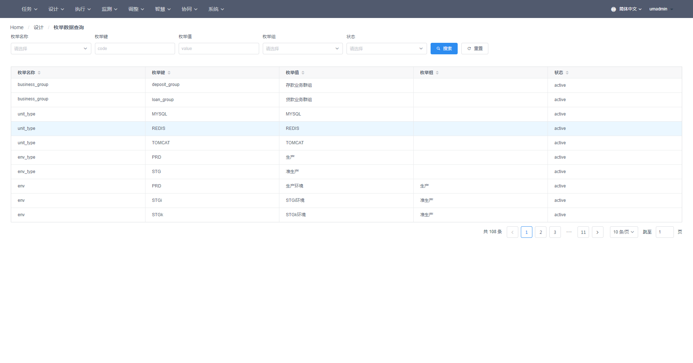
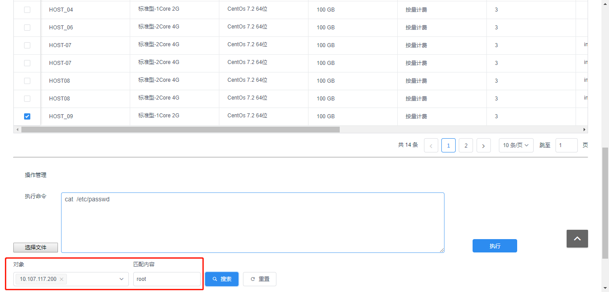

# 主界面菜单介绍

WeCube界面导航包含任务、设计、实现、检测、调整、智能、协同和系统共八个主菜单。

# 系统

## 系统权限管理

访问“系统 > 系统权限管理”，进入 “系统权限管理” 页面。

### 新增角色

点击【+添加角色】，在 “添加角色” 弹框中，输入角色名称，点击【确定】新增角色。

### 给角色分配用户

在“系统权限管理” 页面，选择某一角色，点击该角色右边的“用户”按钮，在“编辑用户”弹框勾选用户，通过点击左移或右移按钮给角色分配用户。

### 给角色分配权限

在“系统权限管理” 页面，选择某一角色，在菜单权限列表和数据权限列表中勾选或去勾选给角色分配权限。

## CMDB模型管理

访问“系统 > CMDB模型管理”页面。页面左边是架构图，右边是编辑区。可通过勾选状态过滤架构图的展示。

CMDB的CI类型和CI属性的状态有以下四种：

- notCreated ：已设计但未创建表
- created ：已创建表
- dirty ：设计已修改表结构但未更新表
- decommissioned：已作废

### 层级

在 “CMDB模型管理” 页面，点击页面左上角的“+”新增层按钮，在“新增层”弹框输入信息点击“提交”按钮可新增层。系统初始配置了5个层级：

- 应用架构层
- 应用部署层
- 资源运行层
- 资源规划层
- 规划设计层

### CI类型

在 “CMDB模型管理” 页面，点击页面左边架构图的某一层名称，页面右边的编辑区可编辑层的信息和CI类型。点击新增CI类型按钮后，在“新增CI类型”弹框输入信息、上传图标，点击“确认”按钮可在该层新增CI类型。

点击CI类型的【暂存】保存CI类型设计表，点击【提交】保存CI类型数据表。

### CI属性

在 “CMDB模型管理” 页面，点击页面左边架构图的某一CI类型，架构图高亮该CI类型与其他关联CI类型的连线，页面右边的编辑区可编辑CI类型的名称以及CI类型的属性。

点击页面右边编辑区的新增CI属性【+】按钮

在弹出框输入属性信息，点击【提交】新增CI属性。

参数说明：

- CI属性名称：	CI属性名称
- CI属性ID：	CI属性在CI类型表中的字段名
- 真实类型：

    text: 文本    
    date：日期    
    textArea：文本框    
    select：枚举    
    multiSelect：多选枚举    
    ref：引用    
    multiRef： 多选引用    
    number：数字

- 是否复用：	Yes 或 No

- 显示在表：	Yes 或 No

- 权限控制：	Yes 或 No

- 允许为空：	Yes 或 No

- 是否可编辑：Yes 或 No

- 自动填充：  Yes 或 No

    自动填充规则配置完成之后，录入CI数据时，会根据自动填充规则自动填充该属性。

    自动填充规则示例：{ 子系统设计 .(系统设计)系统设计 .唯一名称 }_{ 子系统设计 .编码 }
    大括号表示一个对象， 下划线为对象之间的间隔符，间隔符支持数字0-9，“/”,“-”，“_”。
    大括号内的{xxx.yyy}中的xxx是当前CI类型， yyy是xxx的属性，当yyy是一个引用属性时，可再用“.”关联出其引用CI类型的其他属性。

- 过滤规则：过滤规则配置完成之后，录入CI数据时，对配置了过滤规则的属性列进行引用CI选择时，数据根据过滤规则进行过滤， 只允许选择符合条件的数据。

    过滤规则示例：{资源集} IN {(单元).单元.(资源集)资源集}，大括号表示一个对象， IN/=/UNIT为对象之间的运算符，目前只支持这三种运算符。
    
    以“{资源集} IN {(单元).单元.(资源集)资源集}” 为例，第一个对象““{资源集}” 必须是当前引用CI的属性； 大括号内的{(aaa)bbb.(ccc)ddd}中的bbb是当前CI的attr，当bbb自身也是一个引用时， ddd是bbb的attr。过滤规则表达式的开头和结尾必须保持一致。

## 基础数据管理

访问“系统 > 基础数据管理”页面，可管理系统枚举数据增、删、改、查、数据导出功能。

# 设计

## 规划设计

访问 “设计 > 规划设计”页面，选择IDC列表，打开规划设计图。规划设计图根据机房设计、安全区域设计、安全区域连接设计、数据中心节点设计和资源集设计的CI数据自动生成可视化图表。

## 资源规划

访问“设计 > 资源规划”页面，选择IDC列表，打开资源规划图。资源规划图根据机房、安全区域、安全区域连接、数据中心节点和资源集CI数据自动生成可视化图表。

## 应用架构设计

### 架构变更
访问 “设计 > 应用架构设计”页面，选择系统设计，点击【架构变更】打开应用架构设计图。应用架构设计图根据子系统设计、单元设计、服务设计、调用设计和调用时序设计的CI数据自动生成可视化图表。

在页面右边的“调用时序设计”栏位选择调用时序设计，点击【确定】打开调用时序设计序列。

### 架构定版

用户可编辑应用架构设计的CI数据，进行CI数据确定，点击【去定版】完成架构设计定版。

## 应用部署设计

访问“设计 > 应用部署设计”页面，选择系统设计和环境类型查询应用部署信息。应用部署图根据子系统、单元、服务、调用、应用包和实例的CI数据自动生成可视化图表。

**应用逻辑图**：

**应用树状逻辑图**：

**物理部署图**：

**部署详情**：在部署详情页面可以根据系统配置的部署节点点击【预览】查看流程编排。

点击【执行流程】进行应用部署。

## CI数据管理

访问 “设计 > CI数据管理”页面，打开CMDB模型图。

在CMDB模型图双击CI类型图标打开CI数据管理页面，支持CI数据增、删、改、查、确认、数据导出功能。

## CI数据查询

访问 “设计 > CI数据查询”页面，打开CMDB模型图。

在CMDB模型图双击CI类型图标打开CI数据查询页面，支持CI数据查询及导出功能。

## CI综合查询管理

访问 “设计 > CI综合查询管理”页面。

### 创建CI综合查询接口

1）选择根CI类型，打开综合查询名称下拉列表，点击【+】创建CI综合查询。

2）点击CI对象，在弹框点击“属性”选择CI属性，点击“引用”选择引用的CI类型，点击“被引用”选择被引用的CI类型。

3）配置综合查询关联的CI类型和属性后，点击【创建】，添加综合查询接口名称后点击【确定】完成CI综合查询的创建。

### 编辑CI综合查询接口

选择根CI类型，选择综合查询名称。点击CI类型进行编辑，点击【更新】进行修改保存。

### 删除CI综合查询接口

选择根CI类型，选择综合查询名称，点击综合查询名称右侧的删除按钮进行删除。

## CI数据综合查询

1）访问 “设计 > CI数据综合查询”页面，选择根CI类型，选择综合查询名称进行综合数据查询。

2）点击【显示报文】查看综合查询的报文：请求URL、Payload和Result。

3）点击【原始数据】查看单行CI综合查询数据的原始报文。

## 枚举数据管理

访问 “设计 > 枚举数据管理” 页面，可管理公共枚举和私有枚举数据增、删、改、查、数据导出功能。

## 枚举数据查询

访问 “设计 > 枚举数据查询” 页面，可查询及导出公共枚举和私有枚举数据。

# 协同

## 插件注册

### 上传插件包

访问“协同 > 插件注册”页面，点击【上传插件】，选择插件包上传。

系统已支持以下插件包：

- qcloud-resource-management：  腾讯云插件包

- salt-stack-deployment：部署插件包

### 创建插件运行节点

1）在“插件列表”栏位选择插件包。

2）在“实例”栏位下拉框选择主机，点击【端口预览】。

- 可用端口从20000开始，系统根据主机已使用的端口自动计算出可用端口。

- 启动参数：插件包已配置了默认启动参数，用户可根据需求自定义启动参数。

3）点击【创建】启动插件运行节点。

### 销毁插件运行节点

在运行节点右侧点击【销毁】可销毁插件运行节点。

### 日志查询

在日志栏位选择插件运行实例，输入匹配内容进行日志查询。

点击【显示详情】可查看日志详情。

### 注册插件

1）在“插件列表”栏位选择插件包，展开插件接口。

2）点击插件，配置插件操作的输入参数和输出参数，配置数据状态以及插件参数对应的CMDB属性。点击【保存】和【注册】。

- CI Type：下拉选择插件接口对应CMDB的根CI类型。
- 操作：插件包定义插件的操作，如创建、销毁、启动、停止、拷贝、运行等。
- 参数类型：输入参数和输出参数。
- 数据状态：根据插件的需求自定义，支持创建、变更、启动、停止、销毁。
- 参数名：插件自定义的参数名。
- CMDB属性：由根CI类型出发，可用“-”关联出被引用的其他CI类型，可用“.”关联出CI类型的属性。

### 注销插件

在“插件列表”栏位选择插件包，展开插件接口。选择已注册的插件，点击【注销】。

## 任务编排

访问“协同 > 任务编排”页面，流程编排需要设置编排的根CI类型、流程编排的ID、流程编排的名称等全局属性。

### 创建和编辑流程编排

1）创建调用插件的服务节点。

通过点击设置按钮，将任务节点配置为“服务任务”节点类型，设置节点名称后，配置节点的后台代理表达式为“${taskDispatcher}”。

2）设置服务节点对应的插件。

右键点击节点，然后点击【配置插件】，进入配置插件界面。完成设置后，点击【Submit】按钮回到流程编排界面。

- 定位规则：由根CI类型出发，可用“-”关联出被引用的其他CI类型。
- 插件选择：下拉选择列表根据定位规则的叶子节点筛选出相关联的可用插件。

3）创建和编辑事件网关。

4）创建和编辑信号接收器。

5）创建和编辑插件执行结果判定。

添加插件执行结果是否成功的判定，执行成功的下一步设置为正常结束 或者下一个需要执行的服务节点；执行异常的下一步设置为错误结束 。

执行成功对应的路线箭头设置表达式为“${ok}”，执行异常对应的路线箭头设置表达式为“${!ok}”。

错误结束的位置，需要设置错误事件。

6）保存流程编排。

点击【保存编排】保存前面步骤创建的流程编排。

7）表单计算。

点击【表单计算】预览编排应用的CI类型和CI属性列表。

# 执行

## 物料管理

1）选择主菜单“执行”，选择下拉菜单中的“物料管理”，即进入物料管理功能页面。
如下图：

 

2）在左侧的“系统设计版本”下拉框中选择相应的系统设计，下方的系统设计列表自动显示该系统设计下的子系统以及单元的树状列表，选择某个单元之后， 右侧页面刷新， 显示该单元下的物料包清单。
如下图：

3）点击按钮“上传新包”， 可在弹出框中选择本地文件夹中的物料包进行上传。
如下图：

4）上传之后， 可以在物料包清单中看到该物料包。单击选中某个物料包， 下方显示差异化变量文件tab页以及配置的变量列表。
如下图：

5）可对物料包进行确认、删除、配置操作， 点击“配置”按钮，弹出配置页面。
如下图：

包含4项配置：差异化文件、启动脚本、停止脚本、部署脚本， 4项配置旁边都有“选择文件”按钮， 点击按钮， 弹出弹框中显示物料包的目录树结构， 可以目录树中心选择相应的文件。
如下图：

6）配置完成后， 程序会根据配置的差异化文件清单自动解析差异化变量，并在下方的列表中显示。已经配置过的差异化变量不允许修改， 未配置过的差异化变量可以配置跟CMDB CI属性的绑定关系。配置方式： 从“运行实例出发”， 输入“.”获取CI类型的属性， 输入“-”获取CI的引用。
如下图：

## 应用部署

访问“执行 > 应用部署”页面，打开部署任务列表选择部署任务，可查看应用部署详情。

## 批量执行

### 综合查询

访问“执行 > 批量执行”页面，选择执行目标类型、执行目标定位属性、插件选择、综合查询根CI、综合查询名称后查询出相关数据。

### 操作管理

1） 钩选目标数据，在文本框输入执行命令或点击【选择文件】导入执行命令，点击【执行】可在目标主机执行命令。

2） 选择对象，输入匹配内容，点击【搜索】返回匹配内容。

3） 点击【显示详情】查看脚本执行结果详情。

## 编排任务执行

1）访问“执行 > 编排任务执行”页面，打开CMDB模型。

2）在页面的CMDB模型图上双击CI类型图标打开CI数据。

3）选择一行CI数据编辑编排字段，选择流程编排。

4）点击【流程预览】弹出流程编排信息。在流程预览弹框点击【执行】触发流程编排执行。

5) 点击执行查询查看流程编排各个节点的执行情况。绿色代表执行成功。

例如：在“安全区域”执行流程编排“创建安全区域_子网_主机”成功后，流程调用的插件创建了相应的VPC、子网和主机。创建的资产编码分别更新到“安全区域”、“资源集”和“主机”的“资产编码”字段。

