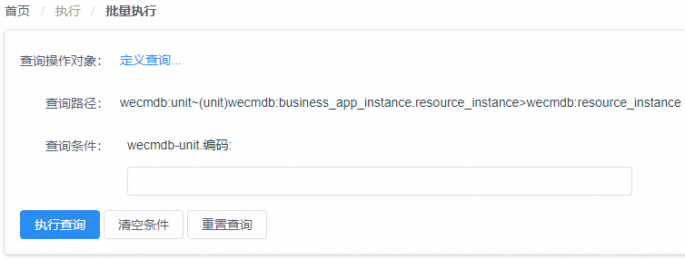
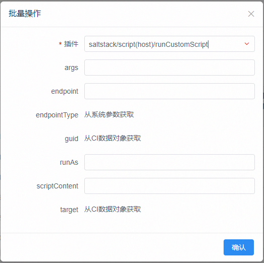

## 批量执行使用指引

“批量执行”功能是为了满足在日常运维管理工作中出现的较为随机和零散的运维操作的执行而设计的。用户可以通过四个步骤来完成针对一批特定数据对象的批量运维操作。

### 1. 定义操作对象的查询方式

以WeCube数据模型中的数据类型以及它们之间的关系为基础，用户需要定义出操作执行目标对象的数据类型、查询路径、查询条件等，这些是操作对象查询方式的关键要素。

其中，*目标数据类型* 对应于批量操作最终执行时的数据对象类型，*查询条件* 可以作为精确指定操作对象范围的过滤条件。由于查询条件可以作用在目标数据类型的属性上，也可以作用在与目标数据类型相关联的其它数据类型上面，因此 *查询路径* 实际上就定义了：
-	用户希望在哪些关联的数据类型和它们的属性上应用查询条件
-	这些关联数据类型之间通过哪种关联关系进行连接并能够最终到达目标数据类型

如图所示，通过点击 “**定义查询...**” 链接,可以在弹出的对话框中定义操作对象的查询方式。

用户需要在对话框中指定刚刚介绍的操作对象查询方式的所有关键要素。

其中，*路径起点* 描述了查询路径中作为起点的第一个数据类型，用户可以在下拉列表中选择一个WeCube数据模型中的任意一个数据类型作为路径起点；

在 *路径起点* 确定后，可以在 *查询路径* 输入框中进一步选择查询路径中涉及到的关联数据属性和对应的数据类型（请参考 *数据模型表达式DME* 的相关概念）；

在 *查询路径* 确定后，*目标类型* 将自动设置为当前输入的查询路径中的最后一个数据类型，也就是最终操作执行时目标对象的数据类型；

同时，用户可以在 *查询条件* 列表中指定将要作为查询条件的数据属性，这些数据属性全部来源于查询路径上包含的数据类型；
另外，由于当前WeCube版本中的数据模型设计，用户需要指定目标数据类型中的一个数据属性作为 业务主键，在操作执行结果的对象列表中将使用这个属性作为操作对象显示时的主要标识。

### 2. 查询并指定操作对象

在定义好查询方式之后，即可进行操作对象的查询，如下图所示，

为定义的查询条件提供输入值后，可以点击 执行查询 按钮，WeCube会按照之前定义好的查询方式返回匹配的数据对象列表，以便用户在列表中选择批量操作的执行对象。

### 3. 选择操作并配置参数

在数据对象列表中选择好批量操作的执行对象后，点击 *批量操作* 按钮可以在弹出的对话框中继续配置将要执行的操作和操作的输入参数。
 

 
在 *插件* 列表中，可以选择一项在WeCube平台中已经注册的插件服务作为将要执行的批量操作，另外，列表中能够选择的插件服务与查询结果的数据类型有关。选择好操作后，对话框中会显示出插件服务对应的输入参数，并且根据WeCube中的插件服务配置提示用户输入本次操作执行中需要的参数值。

### 4. 查看和检索执行结果

批量操作的执行结果是以下图的方式进行展示，

左侧的操作对象列表中显示本次操作执行涉及的操作对象，操作对象将按照之前在查询方式定义中选择的业务主键作为标识来进行显示与区别。每个操作对象的执行结果状态将通过颜色的方式进行区分：
- 红色代表操作执行失败或发生错误
- 绿色代表操作执行顺利完成

用户可以通过点击列表中的操作对象，在右侧的操作结果窗口中查看具体的执行结果信息。另外，如果操作对象过多，可以通过列表上方的输入框对操作对象进行过滤显示，操作对象列表中将只显示与输入关键字相匹配的操作对象。
