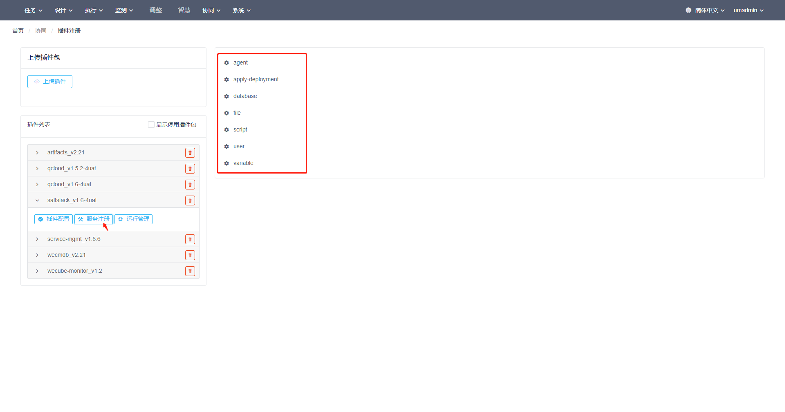

# 插件注册说明

点击菜单“协同 > 插件注册”打开插件注册页面。

## 上传插件包

1. 点击插件注册页面左上角的“上传插件包”按钮，在弹出框选择插件包上传。

   注：同名同版本的插件包不允许重复上传。

   

3. 上传成功的插件包在插件包列表中显示。

   

   

## 插件配置查看

点击插件列表左侧的箭头展开插件功能按钮，点击“插件配置”按钮进行配置查看，页面的右侧展示插件的配置信息。

### 依赖分析

1. “依赖分析”展示本插件包与其他插件包之间的依赖关系图。

   

### 菜单注入

1. "菜单注入"展示本插件在WeCube主菜单下注入的子菜单列表。

   

### 数据模型

1. "数据模型"展示本插件在WeCube系统中已应用的数据模型。

   

   

### 系统参数

1. “系统参数”展示本插件在WeCube系统注册的系统参数列表。

   

### 权限设定

1. "权限设定"展示本插件配置的角色操作菜单的权限。

   

### 运行资源

1. “运行资源”展示"本插件运行容器、数据库和对象存储的配置信息。

   

## 插件配置确认

1. 在插件配置的“确认”页面点击“确认注册插件包”按钮进行插件配置的注册确认。

   注：如果插件提供UI界面，确认插件后需刷新页面加载插件注册的菜单。

## 运行管理

点击插件包的“运行管理”按钮打开运行管理页面。

### 运行容器

1. 在运行管理的服务器下拉框选择插件运行的服务器。

2. 点击“端口预览”按钮查看服务器上可用的端口。

3. 点击“创建”按钮在服务器上运行插件。

   

4. 插件运行成功后在页面显示”运行节点“的信息，点击“销毁”按钮可销毁插件运行。

   

   

### 数据库

1. 在输入框输入数据库查询语句。

2. 点击“执行”按钮。

3. 在搜索结果查看返回的数据。

   

 ### 对象存储

1. 查看对象存储信息。

   

## 数据模型的同步与应用

### 同步数据模型

1. 在插件配置的“数据模型”页面，点击“同步数据模型”按钮可以将插件包最新的数据模型以数据模型关系图展示，每次同步后版本号递增。

   注：以CMDB插件为例，“同步数据模型”和“应用数据模型”功能需在CMDB插件已确认并运行后才可以操作。

   

   

### 应用数据模型

1. 在插件配置的“数据模型”页面进行数据模型同步后，点击“应用数据模型”可以把从插件同步过来的数据模型应用于WeCube系统。

   

## 服务注册

点击插件包的“服务注册”按钮打开服务注册管理页面。页面展示本插件的服务接口列表。一个插件服务可配置多个注册服务列表以供各种场景灵活使用。

### 新增注册列表

1. 点击插件的服务，在页面右侧展开注册页面。

   

2. 点击注册列表下拉框，点击“+”按钮。

   

3. 在“新增注册源”弹出框输入注册名称以及复制源，点击“确定”。

   

4. 输入注册名称，选择目标对象类型。目标对象类型下拉列表包含WeCube系统已注册并运行插件对象，如任务管理插件的任务、CMDB插件的CI类型等。如果目标对象类型不指定则作用于WeCube系统的所有插件对象。

   

5. 配置插件接口的属性。属性类型分为4种类型context、entity、system variable和constant。

   

   1）配置插件接口的属性类型为context，在任务编排配置时该接口的属性参数可以从编排的其他任务的输入或输出参数获取。

   

   2) 配置插件接口的属性类型为eneity，可在属性配置框输入由根目标对象类型为起点关联的CI属性。输入"~"弹出根目标对象被引用的其他CI类型列表，输入“."可弹出本对象的CI属性列表进行配置。

   

   3) 配置插件接口的属性类型为"system variable"，可在属性配置列表选择已在WeCube系统注册的系统参数。

   

   4) 配置插件接口的属性类型为“constant”，在任务编排配置时该接口的属性参数可以通过文本输入框输入常量值。

   

5. 点击“保存”按钮保存插件服务列表的配置信息。

   

6. 点击“注册”按钮注册插件服务列表。

   

### 注销注册列表

1. 点击插件的服务，在页面右侧选择已注册的列表，点击“注销”按钮注销服务。

   

   

## 停用插件包

1. 打开插件包的运行管理页面，点击“销毁”按钮停用插件运行节点。

   

2. 在插件注册页面的插件包右侧点击删除按钮，在确认弹出框点击“确定”按钮。

   注：如果该插件包已注册了UI界面子菜单，需刷新页面更新WeCube系统已删除的子菜单。

   

3. 勾选“显示停用插件包”，可查看所有的插件包列表，包括已停用的。

   
