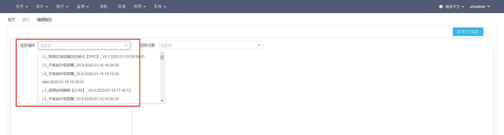
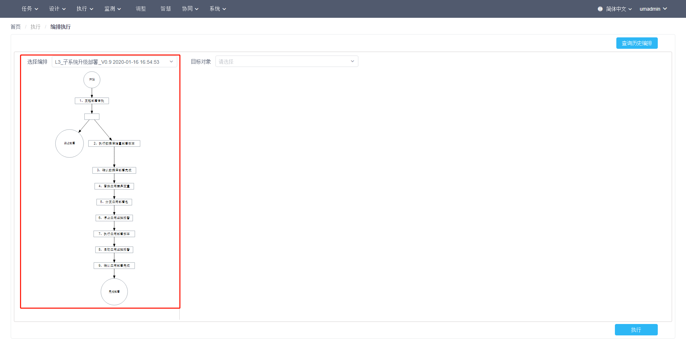
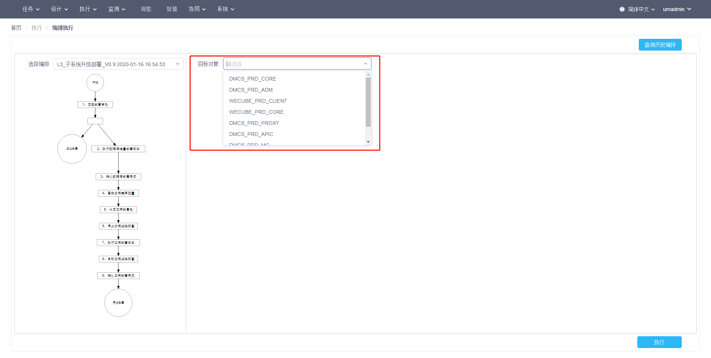
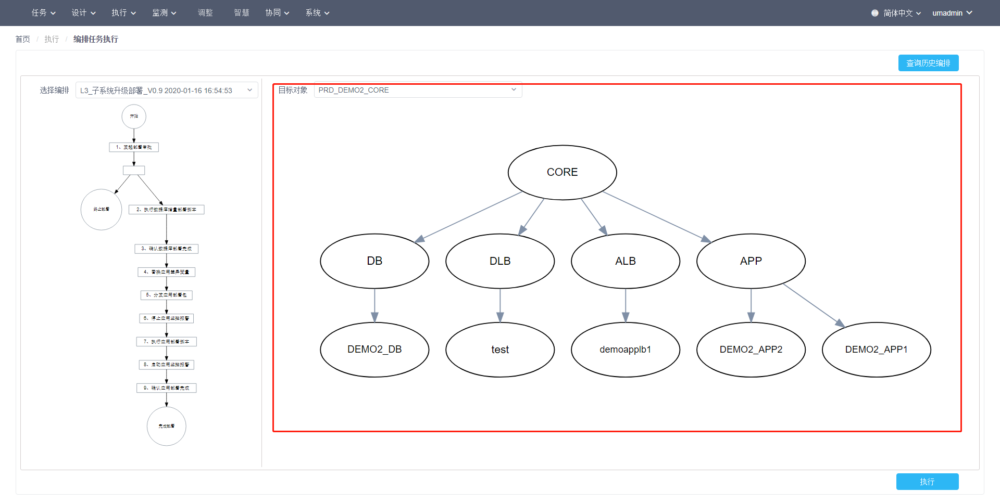
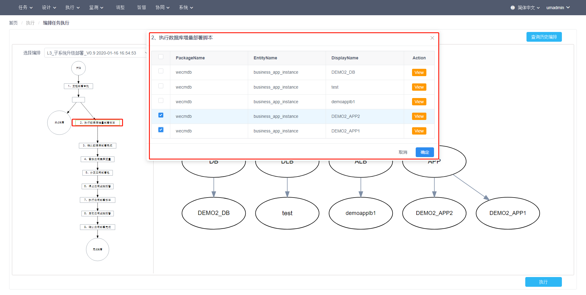
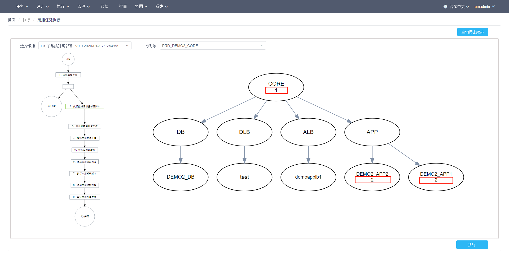
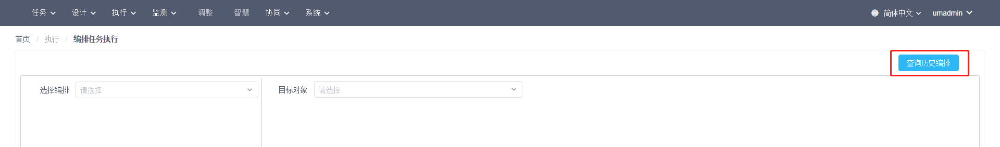
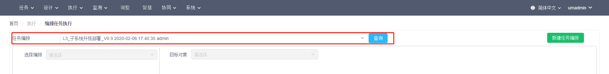
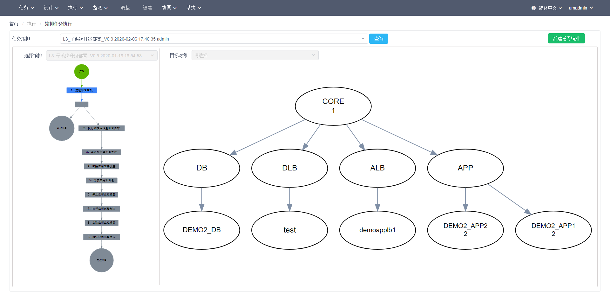
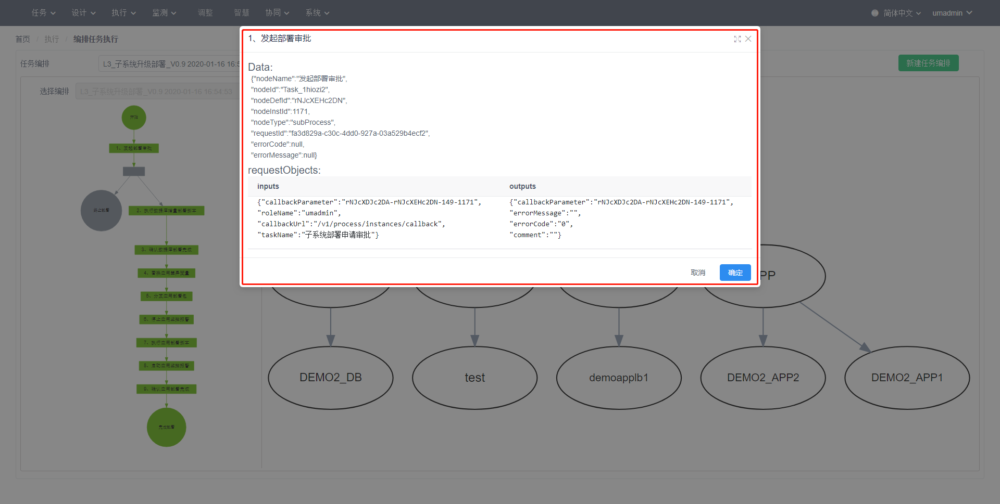

## 编排执行用户使用指引

“编排执行”功能是为了使IT运维人员在WeCube平台上能够进行日常工作中的标准作业程序（SOP）而设计的。

通常来讲，运维部门对各应用系统和IT资源的常见操作流程都应进行标准化及自动化，这些形成的流程规范SOP在WeCube中是以任务编排的形式来进行管理和实施的。所以，当相关人员完成了SOP的梳理并把它们纳入到WeCube的任务编排之后，操作人员便可以根据需要触发执行这些流程中定义好的自动化运维操作以及审批步骤。

用户在WeCube中可以通过“执行” – “编排执行”菜单项进入功能页面，并在页面上新执行一次编排或者查看之前的执行历史。

### 1. 执行编排

进入编排执行页面后，用户可以通过指定一个任务编排并选择目标对象范围来触发一次编排的执行，如下图所示：

 
其中，可供选择的任务编排列表中将显示当前登录用户对应角色可以执行的所有任务编排，包括任务编排的名称、版本及更新时间。当用户选择了一个任务编排后，页面左侧区域中将会显示已选择任务编排的流程缩略图，供用户进行确认。

 
接着，用户可以在目标对象列表中选择流程执行时将要操作的数据对象，可供选择的数据对象列表由 任务编排设计时确定的根数据类型 以及 登录用户对应角色具有的数据权限 这两个因素共同决定。

 
用户选择确定了目标对象后，页面右侧区域中将显示以目标对象为根的关联数据图，以便用户了解和确认编排执行的影响范围。

 
之后，用户通过点击左侧区域的编排流程缩略图中的每个任务节点，在弹出的对话框中为它们进一步配置具体的操作数据对象。

 
选择完毕后，右侧区域的关联数据图中将显示数据对象节点与已配置操作步骤的对应关系，其中，节点名称下面的数字对应左侧流程缩略图中的流程任务节点编号。

 
配置完毕后，点击页面右下方的 执行 按钮，即可触发编排任务在已选择数据对象上的执行过程。此时，WeCube将自动跳转至此次编排执行的历史页面，以供用户追踪编排的执行状态与结果。编排执行历史页面的具体说明请参见下一节。

### 2. 查看执行历史

用户在进入编排执行页面时，可以点击右上方的 “查询历史编排” 按钮， 

 
之后在左侧的 “任务编排” 列表中选择之前已经触发的一次编排执行并点击 “查询” 按钮来查看该编排执行的具体信息。

此时，用户看到的页面与触发一次任务编排执行后跳转的页面完全一致。在此页面上，用户可以看到左侧区域中的流程缩略图以及右侧区域中的关联数据图。

流程缩略图中将使用不同的颜色标识个流程任务节点的执行状态，如下所示：

- 绿色：已成功执行完成
- 红色：已结束执行但有错误发生
- 蓝色：正在执行自动化任务或者审批流程中
- 灰色：尚未开始执行

用户可以通过鼠标悬停或直接点击流程缩略图中的各任务节点来在弹出的对话框中查看更详细的执行信息。
 

