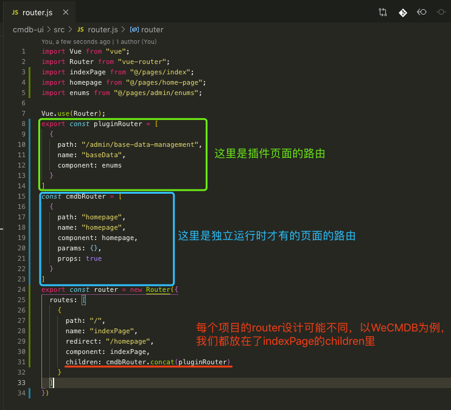
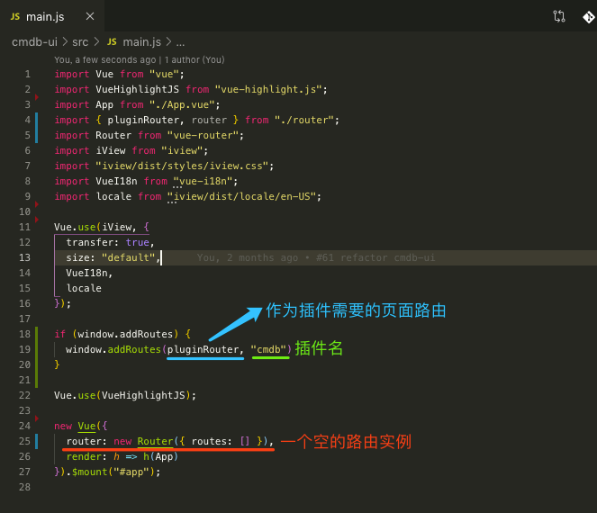
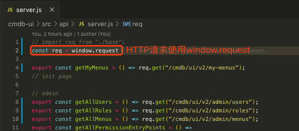
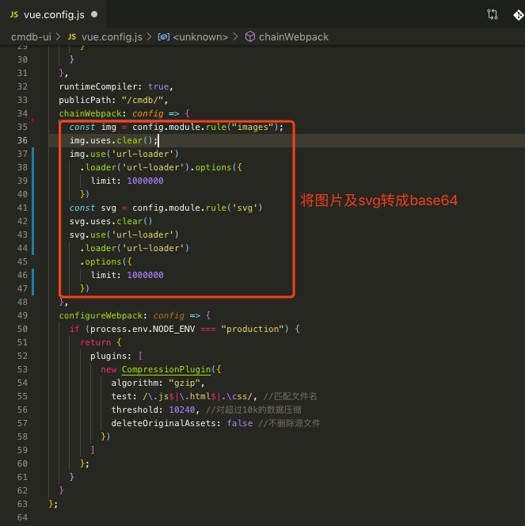
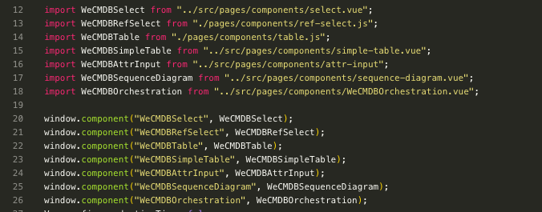
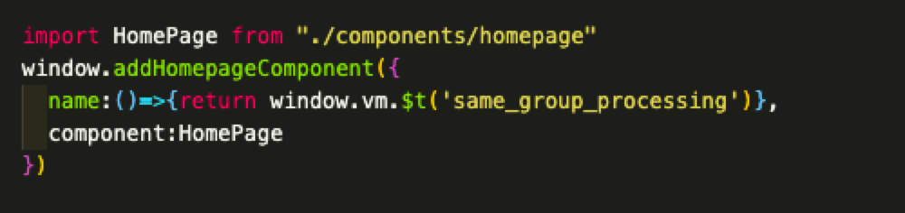
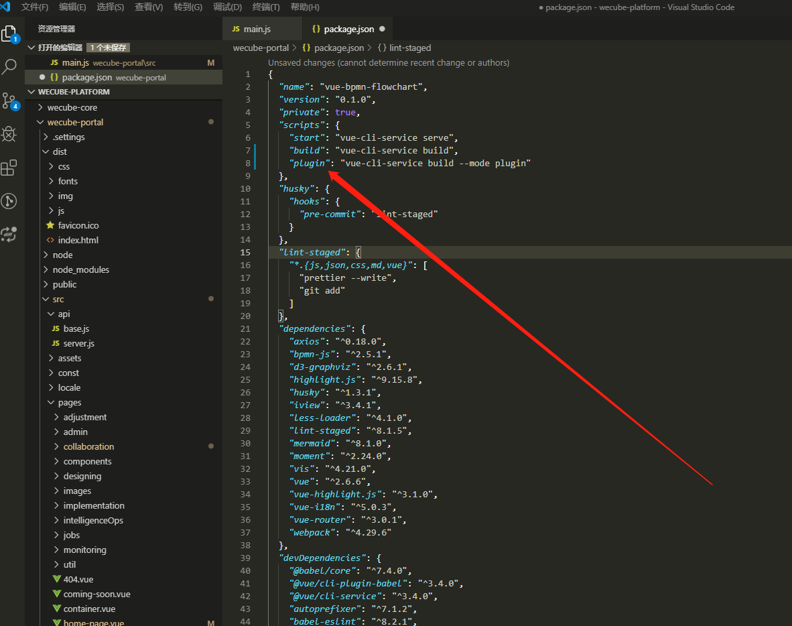
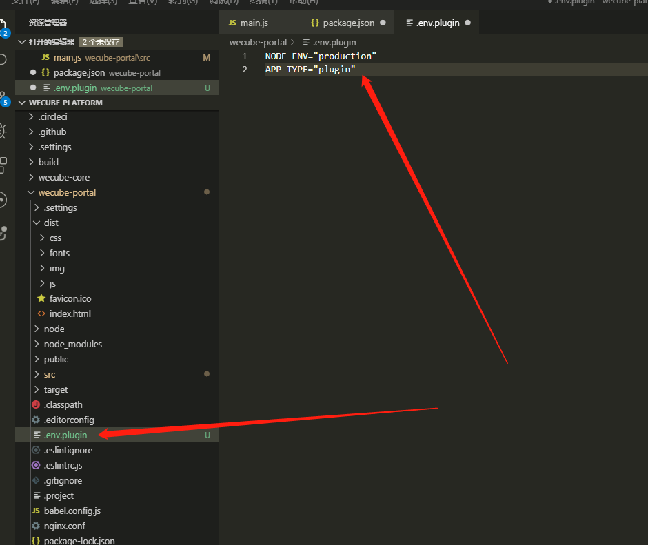
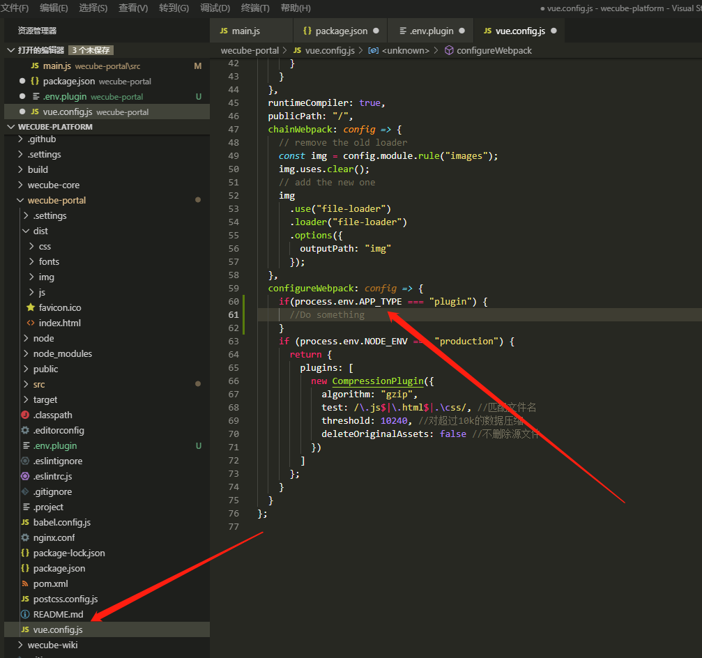
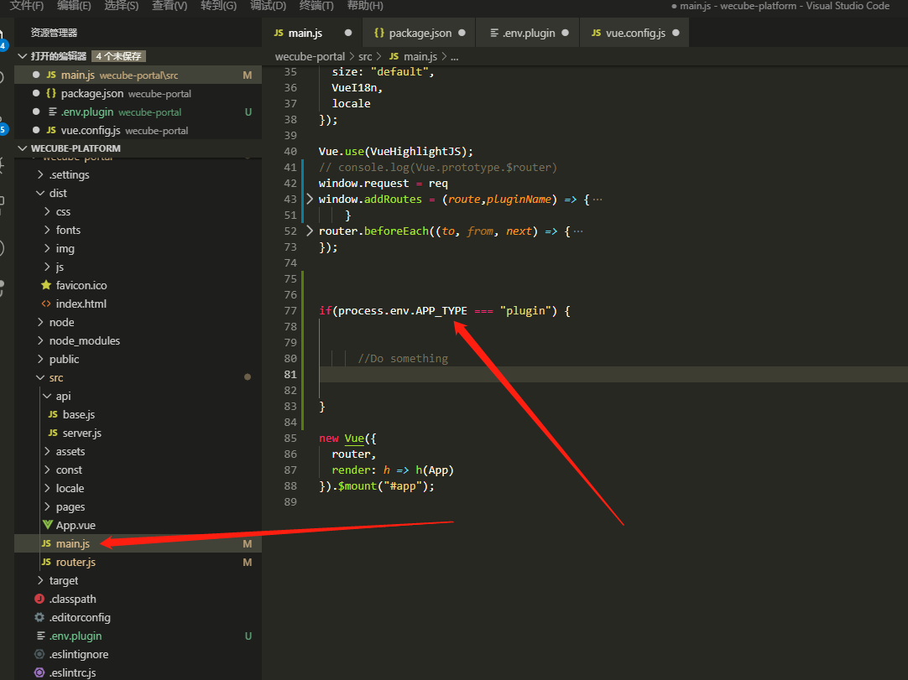

# WeCube Portal 插件前端改造方案

## 背景 

WeCube Portal的前端是采用Vue和Vue-Router实现的单页面应用，为满足WeCube2.0插件注册的需求，前端部分的实现方案是请求插件的前端资源(js、css等)并执行，在Portal中注入插件的路由和对应的组件,为降低现阶段的开发成本，要求插件的前端工程采用和Portal相同的技术栈，最后需要实现的效果是：

1. 插件的各页面在Portal中能正常显示

2. 插件各页面路由调整正常且满足Portal的菜单权限控制

3. 各页面API调用满足Portal的API权限控制

4. 插件各页面图片资源能正常加载

## 分析

因为各个插件都是独立开发的，本身就是一个可独立运行的单页面应用，在一个单页面应用运行态的情况下去加载执行另一个单页面应用的相关资源不可避免的会有一些冲突，正是这些冲突使我们不能实现上面要求的效果：

1. 虚拟Dom挂载的元素冲突   
Vue是把整个页面生成一个虚拟Dom树，然后把虚拟Dom挂载到真实的Dom元素上，两个虚拟Dom树挂载的真实Dom是同一个的话必然会导致页面无法正常显示，因为挂载时是用虚拟Dom生成真实Dom元素然后去替换这个要挂载的Dom元素。

2. 多路由实例冲突   
每个插件有自己的路由实例，去控制页面路由的跳转，多路由实例共存时有可能会造成路由冲突，相同的路由却对应不同的组件，这样用户就不能跳转到自己想要的页面。同时各个路由实例可能会有自己的全局路由守卫钩子，这也会导致页面菜单权限控制异常。

3. 与后端交互的Ajax请求实例不一致   
Portal与后端的API调用是采用axios.js库，所有API的调用都有一个统一的拦截器去做权限控制。插件不管是不是采用相同的库去做API的调用，都会有自己的API调用的实例，这样的话插件的API的调用就在Portal的权限控制范围之外，会导致插件的API调用失败。

4. 插件图片请求路径可能和真实路径不一致   
插件前端在构建资源包时，代码中的图片请求路径和生成后的资源包中图片的路径是一致的，但是插件在注册后，WeCube Core在处理插件的前端静态资源文件时，可能无法保证实际的图片资源路径和代码中的路径一致，这可能会导致插件图片资源请求失败。

5. 插件的全局组件显示失败  
页面路由的控制是依赖于Portal的router实例，所以插件的页面的显示也是依赖于Portal的Vue实例的，运行时会报组件未注册的错误而导致显示失败

## 实现

为保证插件的前端页面在Portal中正常运行，插件的前端工程需要针对上面的冲突做相应的改造

1. **虚拟Dom挂载的元素冲突**   
建议不要在main.js中去`new Vue()`实例,如果有`new Vue()`请修改要mount的元素id，不要使用app等常用的元素id，事实上插件的虚拟根本不需要挂载到真实Dom上，因为Portal只需要插件的路由和对应的component对象，你甚至可以这样写：  
    
   ``new Vue({render: h=> h(app)}).$mount('#abcdefghijk')``
 

2. **多路由实例冲突**   
为保证页面正常的路由跳转和菜单权限的控制，插件应该和Portal使用同一个路由实例，这样就可以共享同一个全局路由守卫钩子函数。这里插件可以调用Portal暴露在window对象上的addRoutes方法，将那些需要再Portal上显示的页面路由以数组形式传入，其实就是Vue Router的addRoutes方法。  

* 菜单部分是依赖于Portal这边动态生成，需要用到的是功能相关的页面，所以插件注册的各个页面都不需要导航菜单和HomePage和404等和功能无关的页面。
* 如果有`new Vue()`为避免代码执行过程中报错，建议传入一个空的路由实例。
* 因为依赖于portal的router实例，插件不需要去`new router()`,如果有，为避免路由控制冲突，插件应该去除全局路由守卫钩子函数。
* 为合并各个组件代码块，减少资源请求次数和请求路径出错的风险，组件的引入方式<strong style="color: red">请不要</strong> 使用懒加载的引入方式：``() => import('@pages/index')``

3. **与后端交互的Ajax请求实例不一致**   
不管是Portal的API调用还是插件的API调用都是在Portal这边做统一的权限控制，所以所有的API都应该走同一个拦截器，插件应该统一使用Portal暴露在window上的axios实例

4. **插件图片请求路径和真实路径不一致**    
如果图片资源中有比较多的小图片，为规避图片路劲不一致和图片资源管理的风险和减少http请求，插件在构建前端资源包时，可以将这些小图片转成base64内嵌在js代码中

5. **插件的全局组件显示失败**   
插件的全局公共组件请调用`window.component()`进行全局注册   

6. **插件组件显示在平台首页**   
插件调用平台暴露的`window.addHomepageComponent`,name属性和component属性都是必传的属性，注意name属性是函数

---
---
## 构建过程参数化配置方案

插件前端工程经过以上改造以后，构建出来的资源包已经不是一个可独立运行的工程。为保证插件前端工程的独立性，以上的改造构建过程应该做参数化配置，通过不同的构建命令，build出不同的资源包，比如：`npm run build`是独立运行的资源包；`npm run plugin` 是插件注册需要的资源包。配置方法如下：
1.	在package.json文件中新增一个插件构建命令，设置自定义mode

2. 在项目根目录下新建配置文件 ，如.env.plugin ，最后的plugin和package.json中设置的mode值一致。在配置文件中将NODE_ENV设置为production, 然后新增自定义环境变量。

3. 在vue.config.js文件中使用新增的自定义环境变量来设置不同的webpack配置。

4. 在项目代码中也可使用新增的自定义环境变量来区分是否是插件才需要的代码逻辑

