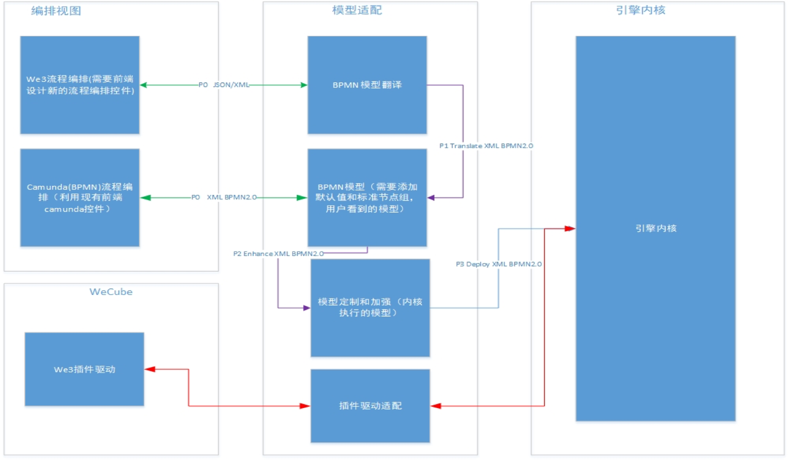

# 流程编排设计功能优化

## 背景   

流程编排遵循标准BPMN2.0，严谨规范。但是对于一般用户，设计一个执行节点，需要关注太多细节和参数，而且这些内容具备共性。

## 分析

如创建虚拟机流程节点设计图所示，目前用户设计创建虚拟机的执行节点，需要有序地添加多个事件节点、活动节点以及多个网关节点，并且需要相应地为各节点添加参数。这样的流程编排设计对一般用户来说，具有一定的操作难度和易错性。    

创建虚拟机流程节点设计图   

    
解决此痛点的可行方案：  

将一个任务节点执行的细节封装，对于一般用户只暴露必要的参数和节点。如创建虚拟机流程节点优化设计图所示，封装后客户针对如上细节不再关注，只会体现为一个执行节点。

创建虚拟机流程节点优化设计图

此时用户只需配置选择插件和超时等少数几个必要参数，并支持通过人工介入触发重试或跳过此执行节点的操作。这极大地降低了一般用户设计流程编排的操作难度和易错性。

流程编排参数配置示意图

流程编排人工介入操作示意图

流程编排（子流程封装）对应关系图

## 设计

流程编排设计总体结构示意图

上图为流程编排设计总体结构，目前wecube的流程编排遵循标准BPMN2.0规范，同时，上面提出的优化方案也同样遵循此规范，流程编排设计具体步骤为：

步骤1，用户在编排视图界面利用现有前端Camunda控件设计流程，遵循标准BPMN2.0设计流程，生成xml文件并传送到后端进行模型适配。

步骤2，模型适配层需要为模型添加默认值和标准节点组，此时的BPMN模型为用户看到的模型。优化方案中的模型将在此步骤中解析为标准BPMN2.0模型。

步骤3，模型适配层对BPMN模型进行定制和加强生成内核执行的模型，引擎内核将部署最终模型。用户可以使用最终模型实现流程实例。

另外，总体结构示意图中，还包括期望的模块以支持未来前端新的流程编排控件和更多的文件格式（如json）。BPMN模型翻译模块将起到中转的作用。

