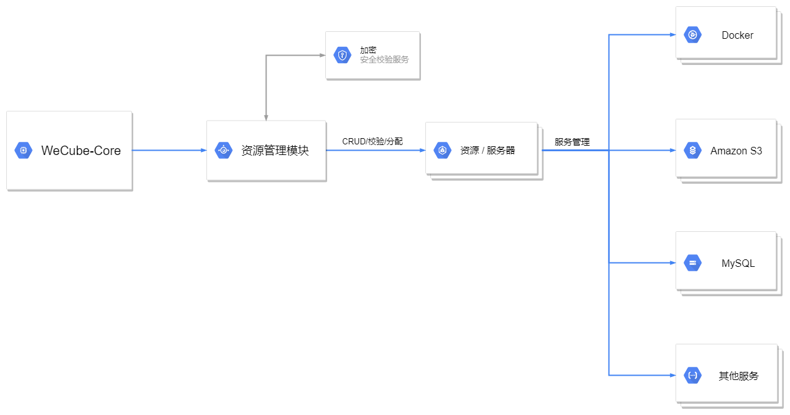
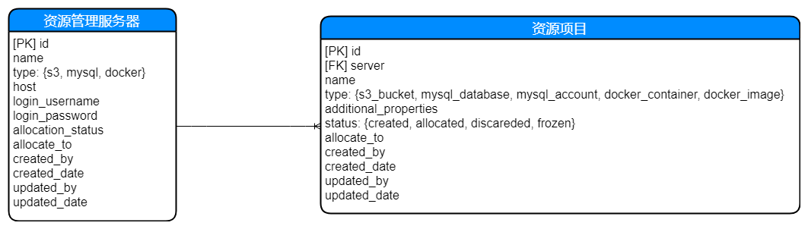

# WeCube API代理与路由

相关讨论可见于 issue: [#4](https://github.com/WeBankPartners/wecube-platform/issues/4)

## 背景
在 WeCube-Core 下需要搭建一个资源管理池模块，以便在插件注册的时候，可以提供容器母机、数据库、Redis、大数据等资源以支持插件的运行和持久化。

## 分析

该模块将主要提供如下两个功能

### 资源服务器管理

需要实现的功能并提供相应接口(暂无界面):

1. CURD 功能
2. 服务器信息校验
3. 服务器分配
   1. S3 (host, access key/secret key), 其中 secret key 采用统一加密方式
   2. MYSQL (host, username, password), 其中 password 采用统一加密方式
   3. DOCKER (host, SSH username/password), 其中password 采用统一加密方式

### 资源管理 

需要实现的功能并提供相应接口(暂无界面):

1. CURD 功能
2. 资源信息校验
3. 资源分配
   1. S3 (bucket)
   2. MYSQL (database/user/password) , password 采用统一加密方式,为插件更新时回写密码之用。
   3. DOCKER (Container, Image)

## 设计

### 资源管理模块流程图

相应功能流程：

1. 插件插入 WeCube-Core 基座，且相关插件需要通过 core 发起资源分配与管理请求
2. WeCube-Core 调用资源管理模块进行相应操作
   1. 对请求与返回结果进行安全校验服务
   2. 对应资源服务器实行管理
   3. 对应服务器下部署的服务 (例如 Docker, Amazon S3, MySQL, 等等) 实行管理

### 资源管理模块对应数据库字段设计

